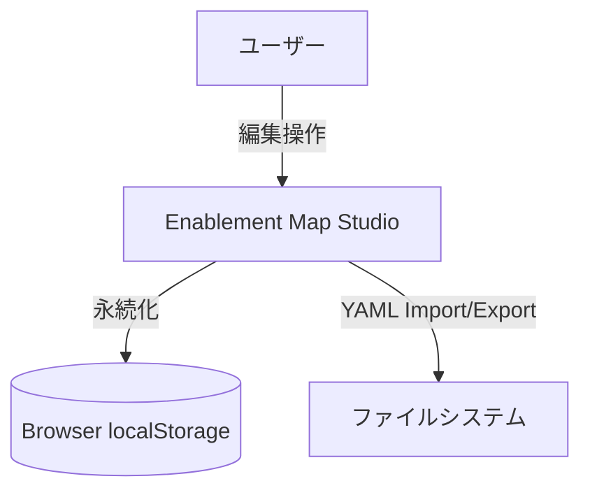
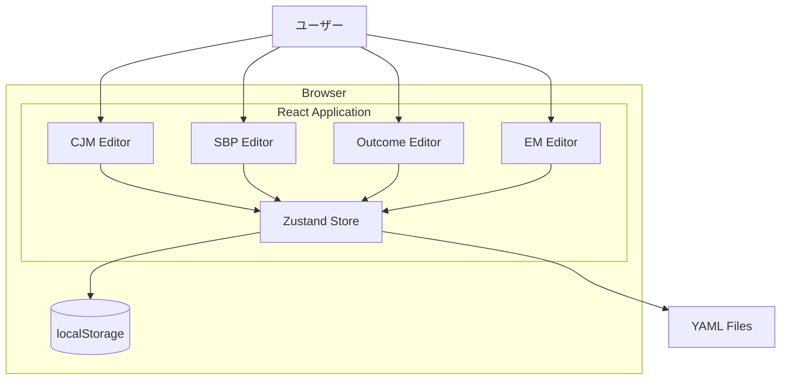
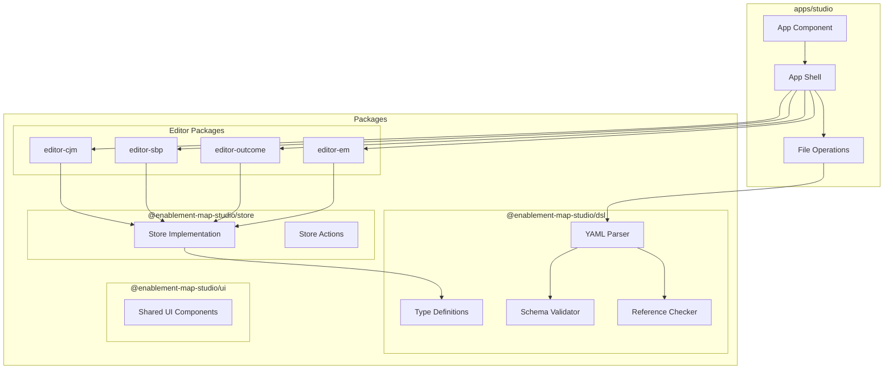
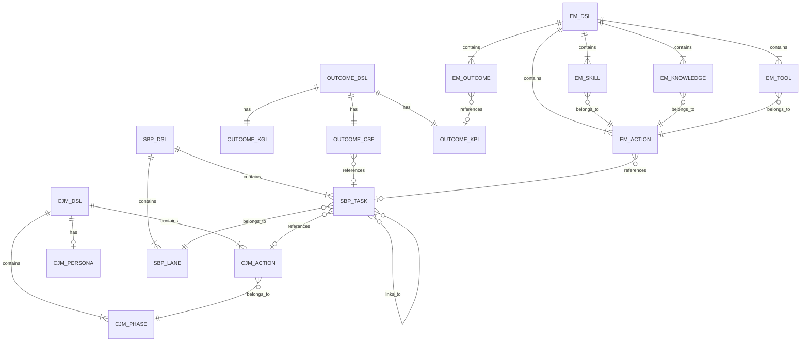
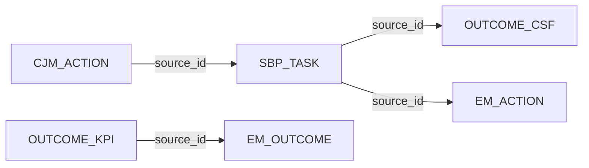
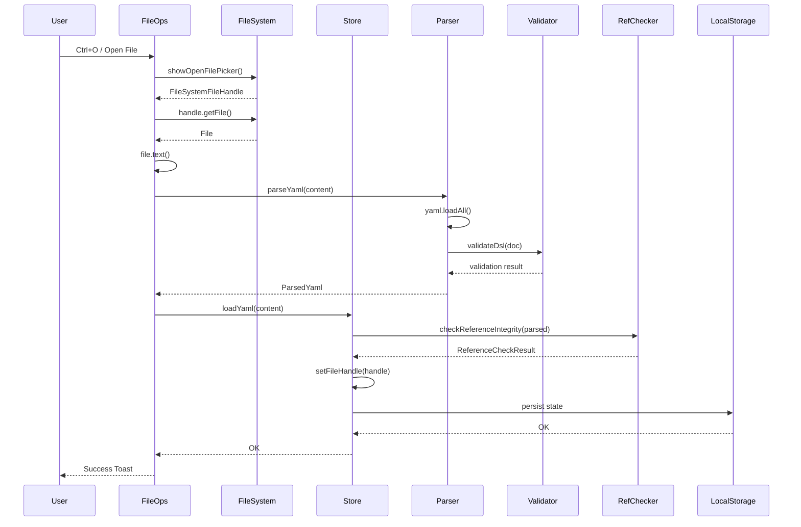
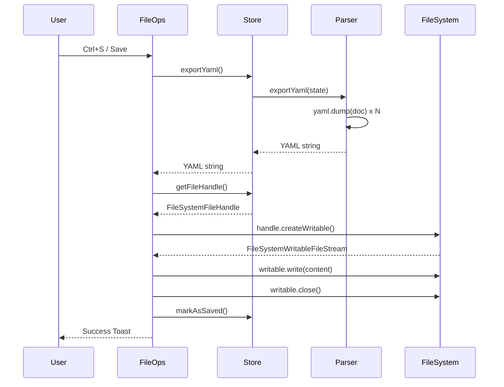
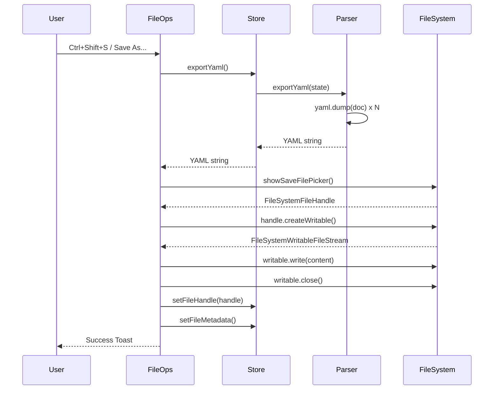
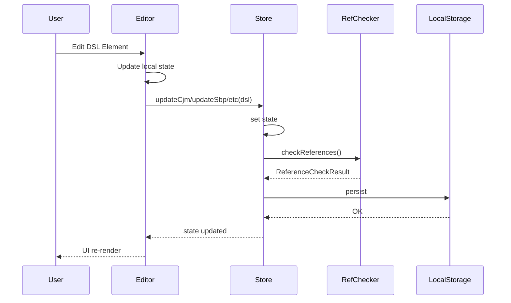
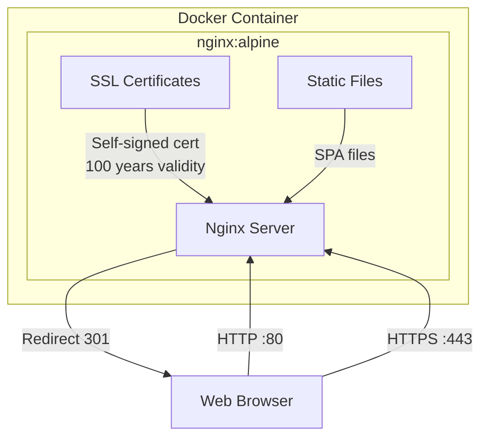

# ARCHITECTURE

## 概要

Enablement Map Studioは、ブラウザ上で動作する単一ユーザー向けのWebアプリケーションです。
データはブラウザのlocalStorageに永続化され、File System Access APIを使用してローカルのYAMLファイルと直接読み書きできます。

## アーキテクチャ (C4 Model)

### Level 1: システムコンテキスト

| 要素名 | 説明 |
|--------|------|
| ユーザー | 単一のブラウザユーザー |
| Enablement Map Studio | SPAアプリケーション (React + Vite) |
| Browser localStorage | ブラウザ内のデータストレージ |
| ファイルシステム | YAMLファイルのインポート/エクスポート先 |

### Level 2: コンテナ

| 要素名 | 説明 |
|--------|------|
| CJM Editor | カスタマージャーニーマップの編集UI |
| SBP Editor | サービスブループリントの編集UI |
| Outcome Editor | 成果定義の編集UI |
| EM Editor | イネーブルメントマップの編集UI |
| Zustand Store | アプリケーション全体の状態管理 |
| localStorage | ブラウザ内データ永続化 |
| YAML Files | データのインポート/エクスポート形式 |

### Level 3: コンポーネント

| 要素名 | 説明 |
|--------|------|
| Type Definitions | DSLの型定義 (CjmDsl, SbpDsl, OutcomeDsl, EmDsl) |
| YAML Parser | YAML形式のパース/エクスポート |
| Schema Validator | JSONスキーマによるバリデーション |
| Reference Checker | DSL間の参照整合性チェック |
| Store Implementation | Zustandストアの実装 (persist middleware) |
| Store Actions | loadYaml, exportYaml, updateCjm等のアクション |
| Shared UI Components | Toast, ConfirmDialog, ErrorDialog等 |
| Editor Packages | 各エディタの実装パッケージ |
| File Operations | YAML Import/Export/Sample Load/Clear Canvas |

## データモデル

### ER図

| エンティティ | 説明 |
|------------|------|
| CJM_DSL | カスタマージャーニーマップのルート |
| CJM_PERSONA | ペルソナ情報 |
| CJM_PHASE | ジャーニーのフェーズ |
| CJM_ACTION | 顧客のアクション |
| SBP_DSL | サービスブループリントのルート |
| SBP_LANE | スイムレーン (cjm/human/team/system) |
| SBP_TASK | タスク (業務プロセスのステップ) |
| OUTCOME_DSL | 成果定義のルート |
| OUTCOME_KGI | 重要目標達成指標 |
| OUTCOME_CSF | 重要成功要因 |
| OUTCOME_KPI | 重要業績評価指標 |
| EM_DSL | イネーブルメントマップのルート |
| EM_OUTCOME | 成果 |
| EM_ACTION | 必要な行動 |
| EM_SKILL | スキル |
| EM_KNOWLEDGE | ナレッジ |
| EM_TOOL | ツール |

### 参照関係

| 参照元 | 参照先 | フィールド | 説明 |
|-------|-------|-----------|------|
| SBP_TASK | CJM_ACTION | source_id | タスクが対応する顧客アクション |
| OUTCOME_CSF | SBP_TASK | source_id | CSFの根拠となるタスク |
| EM_ACTION | SBP_TASK | source_id | 行動が対応するタスク |
| EM_OUTCOME | OUTCOME_KPI | source_id | 成果が対応するKPI |

## 処理フロー

### YAML読み込みフロー（File System Access API）

| ステップ | 説明 |
|---------|------|
| 1. Ctrl+O / Open File | ユーザーがショートカットまたはボタンでファイルを開く |
| 2. showOpenFilePicker | File System Access APIでファイル選択ダイアログを表示 |
| 3. FileSystemFileHandle | 選択されたファイルへのハンドルを取得 |
| 4. getFile | ハンドルからFileオブジェクトを取得 |
| 5. file.text | ファイル内容をテキストとして読み込み |
| 6. parseYaml | js-yamlでパース (複数ドキュメント対応) |
| 7. validateDsl | ajvでJSONスキーマ検証 |
| 8. loadYaml | Zustandストアに格納 |
| 9. checkReferenceIntegrity | DSL間の参照整合性チェック |
| 10. setFileHandle | ファイルハンドルを保存（Save用） |
| 11. persist | localStorage に永続化 |
| 12. Success Toast | 成功通知を表示 |

### YAML保存フロー（File System Access API）

#### Save（上書き保存）

| ステップ | 説明 |
|---------|------|
| 1. Ctrl+S / Save | ユーザーがショートカットまたはボタンで保存 |
| 2. exportYaml | Zustandストアから状態を取得 |
| 3. yaml.dump | 各DSLをYAML形式にシリアライズ |
| 4. getFileHandle | 保存されているファイルハンドルを取得 |
| 5. createWritable | 書き込み可能なストリームを作成 |
| 6. write & close | ファイルに書き込んで閉じる |
| 7. markAsSaved | 未保存フラグをクリア |
| 8. Success Toast | 成功通知を表示 |

#### Save As...（別名で保存）

| ステップ | 説明 |
|---------|------|
| 1. Ctrl+Shift+S / Save As... | ユーザーがショートカットまたはボタンで別名保存 |
| 2. exportYaml | Zustandストアから状態を取得 |
| 3. yaml.dump | 各DSLをYAML形式にシリアライズ |
| 4. showSaveFilePicker | File System Access APIで保存先を選択 |
| 5. FileSystemFileHandle | 新しいファイルへのハンドルを取得 |
| 6. createWritable | 書き込み可能なストリームを作成 |
| 7. write & close | ファイルに書き込んで閉じる |
| 8. setFileHandle | 新しいファイルハンドルを保存 |
| 9. setFileMetadata | ファイル名と保存時刻を更新 |
| 10. Success Toast | 成功通知を表示 |

### エディタ操作フロー

| ステップ | 説明 |
|---------|------|
| 1. Edit Element | ユーザーがUI上で要素を編集 |
| 2. Update local state | エディタ内のReact stateを更新 |
| 3. updateXxx | Zustandストアの更新アクションを実行 |
| 4. checkReferences | 参照整合性を自動チェック |
| 5. persist | localStorageに永続化 |
| 6. UI re-render | 変更がUIに反映される |

## デプロイメント構成

### Dockerコンテナ構成

| 要素名 | 説明 |
|--------|------|
| nginx | Webサーバー (nginx:alpine) |
| SSL Certificates | 自己署名証明書 (100年有効) |
| Static Files | ビルド済みReactアプリケーション |
| HTTP :80 | HTTPSへの自動リダイレクト |
| HTTPS :443 | TLSv1.2/1.3でセキュアな接続 |

### SSL証明書

Dockerイメージには以下の特徴を持つ自己署名証明書が含まれています：

| 項目 | 内容 |
|------|------|
| 証明書タイプ | 自己署名 (OpenSSL) |
| 有効期限 | 100年間 (36500日) |
| キーサイズ | RSA 2048bit |
| Subject Alternative Name (SAN) | localhost, *.localhost, 127.0.0.1, ::1, 0.0.0.0 |
| TLS Protocol | TLSv1.2, TLSv1.3 |
| ビルド時生成 | `/etc/nginx/ssl/` に配置 |

証明書生成スクリプト: [`docker/generate-cert.sh`](docker/generate-cert.sh)

### nginx設定

| 設定項目 | 内容 |
|---------|------|
| ポート80 | HTTPSへの自動リダイレクト (301) |
| ポート443 | TLS/SSL対応 |
| gzip圧縮 | 有効 (レベル6) |
| 静的ファイルキャッシュ | 1年間 (immutable) |
| セキュリティヘッダー | HSTS, X-Frame-Options, X-Content-Type-Options, X-XSS-Protection |
| SPA Fallback | すべてのルートで index.html を返す |

nginx設定ファイル: [`docker/nginx.conf`](docker/nginx.conf)

## 制約と課題

### 現状の制約

| 項目 | 内容 |
|------|------|
| ユーザー数 | 単一ユーザーのみ (ブラウザごとに独立) |
| データ共有 | YAMLファイルの手動エクスポート/インポートのみ |
| 同時編集 | 不可能 (最後に保存した内容で上書き) |
| バージョン管理 | なし (Undo/Redoはセッション内のみ) |
| 認証・認可 | なし |
| データバックアップ | ユーザー自身がYAMLファイルを保存 |
| 衝突解決 | なし (手動マージが必要) |

### 課題

| 課題 | 説明 |
|------|------|
| データ消失リスク | localStorageのクリアでデータが失われる |
| 共同作業の困難さ | 複数人での編集は手動でのファイル共有が必要 |
| 変更履歴の欠如 | 誰がいつ何を変更したか追跡できない |
| 衝突の手動解決 | 複数人が並行編集すると手動マージが必要 |
| スケーラビリティ | 大規模チームでの利用には不向き |
