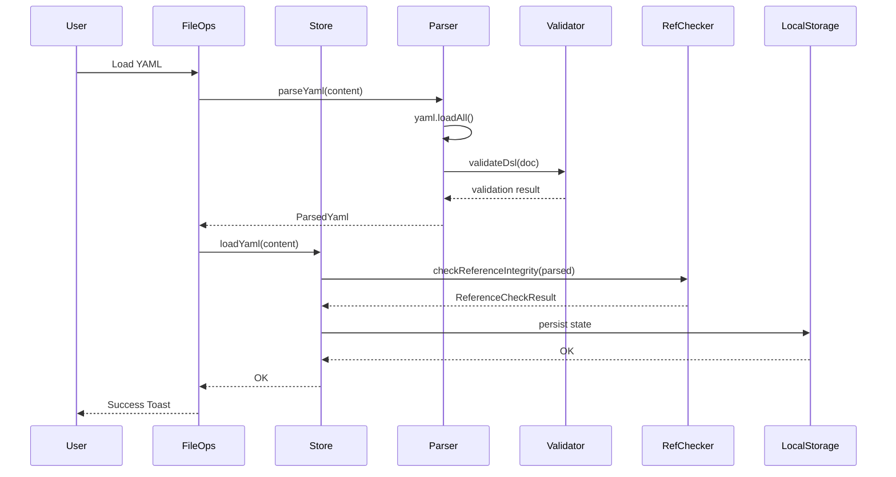
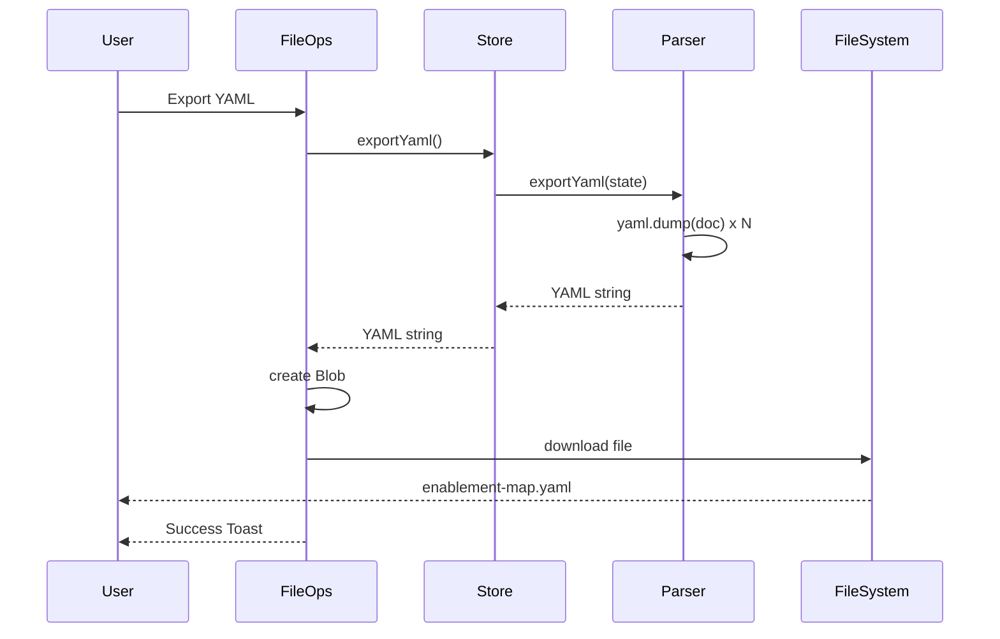

# ARCHITECTURE

## 概要

Enablement Map Studioは、ブラウザ上で動作する単一ユーザー向けのWebアプリケーションです。
データはブラウザのlocalStorageに永続化され、File System Access APIを使用してローカルのYAMLファイルと直接読み書きできます。

### 実装済み機能

- **File System Access API**: ローカルファイルとの直接読み書き（Open File, Save, Save As...）
- **キーボードショートカット**: Ctrl+S / Cmd+S で上書き保存
- **未保存変更の検知**: ファイル名に `*` マークを表示、ブラウザ終了時に警告
- **Git連携サポート**: ローカルにcloneしたYAMLファイルを編集し、Gitでバージョン管理可能

### ブラウザサポート

| ブラウザ | サポート状況 |
|---------|-------------|
| Chrome 86+ | ✅ 完全サポート |
| Edge 86+ | ✅ 完全サポート |
| Safari 15.2+ | ✅ 完全サポート |
| Firefox | ❌ File System Access API 非対応 |

## アーキテクチャ (C4 Model)

### Level 1: システムコンテキスト

| 要素名 | 説明 |
|--------|------|
| ユーザー | 単一のブラウザユーザー |
| Enablement Map Studio | SPAアプリケーション (React + Vite) |
| Browser localStorage | ブラウザ内のデータストレージ |
| ファイルシステム | YAMLファイルのインポート/エクスポート先 |

### Level 2: コンテナ

| 要素名 | 説明 |
|--------|------|
| CJM Editor | カスタマージャーニーマップの編集UI |
| SBP Editor | サービスブループリントの編集UI |
| Outcome Editor | 成果定義の編集UI |
| EM Editor | イネーブルメントマップの編集UI |
| Zustand Store | アプリケーション全体の状態管理 |
| localStorage | ブラウザ内データ永続化 |
| YAML Files | データのインポート/エクスポート形式 |

### Level 3: コンポーネント

| 要素名 | 説明 |
|--------|------|
| Type Definitions | DSLの型定義 (CjmDsl, SbpDsl, OutcomeDsl, EmDsl) |
| YAML Parser | YAML形式のパース/エクスポート |
| Schema Validator | JSONスキーマによるバリデーション |
| Reference Checker | DSL間の参照整合性チェック |
| Store Implementation | Zustandストアの実装 (persist middleware) |
| Store Actions | loadYaml, exportYaml, updateCjm等のアクション |
| Shared UI Components | Toast, ConfirmDialog, ErrorDialog等 |
| Editor Packages | 各エディタの実装パッケージ |
| File Operations | YAML Import/Export/Sample Load/Clear Canvas |

## データモデル

### ER図

| エンティティ | 説明 |
|------------|------|
| CJM_DSL | カスタマージャーニーマップのルート |
| CJM_PERSONA | ペルソナ情報 |
| CJM_PHASE | ジャーニーのフェーズ |
| CJM_ACTION | 顧客のアクション |
| SBP_DSL | サービスブループリントのルート |
| SBP_LANE | スイムレーン (cjm/human/team/system) |
| SBP_TASK | タスク (業務プロセスのステップ) |
| OUTCOME_DSL | 成果定義のルート |
| OUTCOME_KGI | 重要目標達成指標 |
| OUTCOME_CSF | 重要成功要因 |
| OUTCOME_KPI | 重要業績評価指標 |
| EM_DSL | イネーブルメントマップのルート |
| EM_OUTCOME | 成果 |
| EM_ACTION | 必要な行動 |
| EM_SKILL | スキル |
| EM_KNOWLEDGE | ナレッジ |
| EM_TOOL | ツール |

### 参照関係

| 参照元 | 参照先 | フィールド | 説明 |
|-------|-------|-----------|------|
| SBP_TASK | CJM_ACTION | source_id | タスクが対応する顧客アクション |
| OUTCOME_CSF | SBP_TASK | source_id | CSFの根拠となるタスク |
| EM_ACTION | SBP_TASK | source_id | 行動が対応するタスク |
| EM_OUTCOME | OUTCOME_KPI | source_id | 成果が対応するKPI |

## 処理フロー

### YAML読み込みフロー

| ステップ | 説明 |
|---------|------|
| 1. Load YAML | ユーザーがYAMLファイルを選択 |
| 2. parseYaml | js-yamlでパース (複数ドキュメント対応) |
| 3. validateDsl | ajvでJSONスキーマ検証 |
| 4. loadYaml | Zustandストアに格納 |
| 5. checkReferenceIntegrity | DSL間の参照整合性チェック |
| 6. persist | localStorage に永続化 |
| 7. Success Toast | 成功通知を表示 |

### YAML出力フロー

| ステップ | 説明 |
|---------|------|
| 1. Export YAML | ユーザーがエクスポートを実行 |
| 2. exportYaml | Zustandストアから状態を取得 |
| 3. yaml.dump | 各DSLをYAML形式にシリアライズ |
| 4. create Blob | ファイルとしてダウンロード可能な形式に変換 |
| 5. download file | ブラウザのダウンロード機能で保存 |
| 6. Success Toast | 成功通知を表示 |

### エディタ操作フロー

| ステップ | 説明 |
|---------|------|
| 1. Edit Element | ユーザーがUI上で要素を編集 |
| 2. Update local state | エディタ内のReact stateを更新 |
| 3. updateXxx | Zustandストアの更新アクションを実行 |
| 4. checkReferences | 参照整合性を自動チェック |
| 5. persist | localStorageに永続化 |
| 6. UI re-render | 変更がUIに反映される |

## 制約と課題

### 現状の制約

| 項目 | 内容 |
|------|------|
| ユーザー数 | 単一ユーザーのみ (ブラウザごとに独立) |
| データ共有 | YAMLファイルの手動エクスポート/インポートのみ |
| 同時編集 | 不可能 (最後に保存した内容で上書き) |
| バージョン管理 | なし (Undo/Redoはセッション内のみ) |
| 認証・認可 | なし |
| データバックアップ | ユーザー自身がYAMLファイルを保存 |
| 衝突解決 | なし (手動マージが必要) |

### 課題

| 課題 | 説明 |
|------|------|
| データ消失リスク | localStorageのクリアでデータが失われる |
| 共同作業の困難さ | 複数人での編集は手動でのファイル共有が必要 |
| 変更履歴の欠如 | 誰がいつ何を変更したか追跡できない |
| 衝突の手動解決 | 複数人が並行編集すると手動マージが必要 |
| スケーラビリティ | 大規模チームでの利用には不向き |
