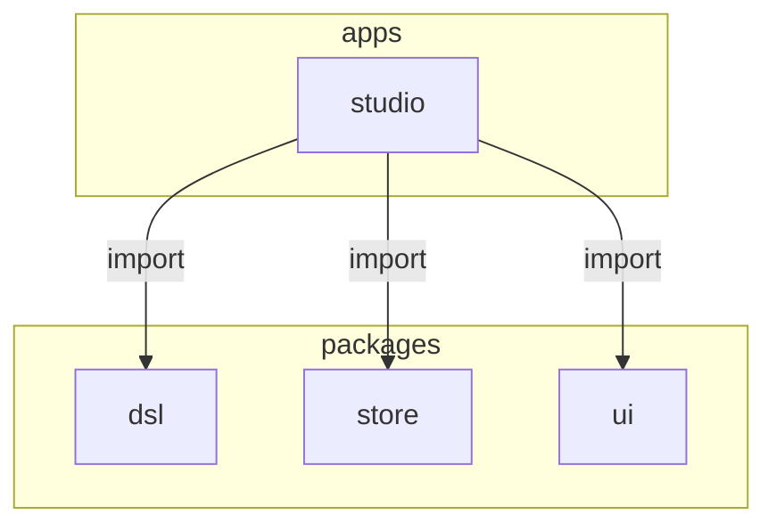
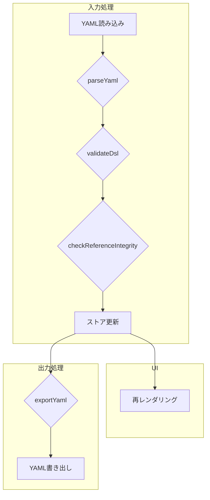
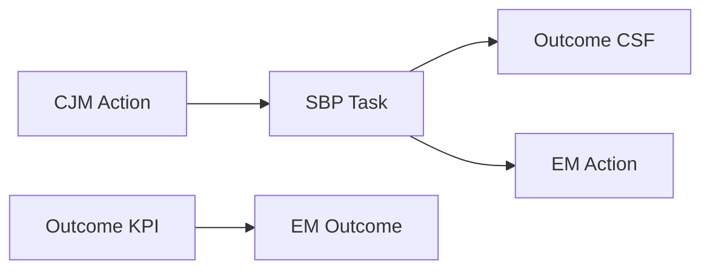

以下に、指定されたルールに従って整理したドキュメントを示します。

-----

# Enablement Map Studio 開発ガイドライン

## 1\. はじめに

### 1.1. プロジェクト概要

Enablement Map Studioは、顧客体験から事業成果創出までの一連のプロセスを設計するためのWebアプリケーションです。
本アプリケーションは、YAML形式で定義された4つのDSL（ドメイン固有言語）を視覚的に編集する機能を提供し、イネーブルメントサイクルの「整理ステージ」を支援します。

## 2\. アーキテクチャ

### 2.1. 全体構成

本プロジェクトは、pnpm workspaceを利用したモノレポ構成を採用しています。アプリケーション本体と、DSL定義や状態管理などの共通機能をパッケージとして分離しています。

| 要素名 | 説明 |
| :--- | :--- |
| `apps/studio` | メインとなるViteとReactで構築されたアプリケーション |
| `packages/dsl` | DSLの型定義、パーサー、バリデーター、参照チェッカー |
| `packages/store` | Zustandを利用した状態管理と、localStorageによるデータ永続化 |
| `packages/ui` | 複数のエディタで共有されるUIコンポーネント |

### 2.2. 技術スタック

| 分類 | 技術 |
| :--- | :--- |
| フロントエンド | React 18+, TypeScript, Vite |
| 状態管理 | Zustand |
| ルーティング | React Router v6 |
| UIライブラリ | Material-UI (MUI) v7 |
| DSL処理 | js-yaml, ajv |
| CJMエディタ | MUI Table, Recharts, @dnd-kit |
| SBPエディタ | @xyflow/react |
| コード品質 | qlty (biome, prettier, eslint) |
| パッケージ管理 | pnpm workspaces |

### 2.3. データフロー

Zustandストアを単一の信頼できる情報源 (Single Source of Truth) とし、すべてのエディタがこのストアを共有します。データはlocalStorageに永続化されます。

#### YAML処理パイプライン

YAMLファイルの読み込みと書き出しは、以下のパイプラインで処理します。

| 要素名 | 説明 |
| :--- | :--- |
| `parseYaml` | js-yamlを利用し、複数ドキュメント形式のYAMLファイルを解析 |
| `validateDsl` | ajvを利用し、JSONスキーマに基づきDSLデータを検証 |
| `checkReferenceIntegrity` | DSL間の参照整合性を検査 |
| `ストア更新` | 検証済みのデータをZustandストアに格納し、UIの再レンダリングをトリガー |
| `exportYaml` | 全てのDSLデータを単一のYAMLファイルに結合 |

### 2.4. データモデル (DSL)

本アプリケーションでは、`kind`フィールドで識別される4種類のDSLを扱います。

#### 2.4.1. DSL間の参照関係

各DSLは、`source_id`などのフィールドを用いて相互に参照し合います。

| 要素名 | 説明 |
| :--- | :--- |
| `CJM Action` | カスタマージャーニーマップ上の顧客のアクション |
| `SBP Task` | サービスブループリント上のタスク。CJM Actionを`source_id`で参照 |
| `Outcome CSF` | 重要成功要因。SBP Taskを`source_id`で参照 |
| `Outcome KPI` | 重要業績評価指標 |
| `EM Outcome` | イネーブルメントマップの成果。Outcome KPIを`source_id`で参照 |
| `EM Action` | イネーブルメントアクション。SBP Taskを`source_id`で参照 |

#### 2.4.2. CJM (Customer Journey Map) DSL

顧客体験を定義します。

| 要素 | 説明 |
| :--- | :--- |
| `kind` | `'cjm'` |
| `persona` | ペルソナ情報 (名前、説明) |
| `phases` | 旅のフェーズの配列 |
| `actions` | 顧客のアクションの配列。各アクションはフェーズに紐づき、感情スコア (-2から2) を持つ |

#### 2.4.3. SBP (Service Blueprint) DSL

顧客体験を支えるサービス提供側のプロセスを定義します。

| 要素 | 説明 |
| :--- | :--- |
| `kind` | `'sbp'` |
| `lanes` | スイムレーンの配列 |
| `tasks` | タスクの配列。CJMの`Action`を`source_id`で参照可能。`link_to`でタスク間を接続 |

#### 2.4.4. Outcome DSL

事業成果を定義します。

| 要素 | 説明 |
| :--- | :--- |
| `kind` | `'outcome'` |
| `kgi` | 重要目標達成指標 |
| `primary_csf` | 重要成功要因。SBPの`Task`を`source_id`で参照 |
| `primary_kpi` | 重要業績評価指標 |

#### 2.4.5. EM (Enablement Map) DSL

事業成果を達成するためのイネーブルメント要素を定義します。

| 要素 | 説明 |
| :--- | :--- |
| `kind` | `'em'` |
| `outcomes` | 成果の配列。Outcomeの`KPI`を`source_id`で参照 |
| `actions` | アクションの配列。SBPの`Task`を`source_id`で参照 |
| `skills` | `action_id`でアクションに紐づくスキル |
| `knowledge` | `action_id`でアクションに紐づくナレッジ |
| `tools` | `action_id`でアクションに紐づくツール |

### 2.5. 状態管理

アプリケーションの状態はZustandで管理します。

#### 2.5.1. Zustandストア

  - `cjm`, `sbp`, `outcome`, `em` の4つのDSLオブジェクトを状態として保持します。
  - `loadYaml()`や`exportYaml()`などのメソッドを提供します。
  - DSLの更新時には、自動で参照整合性チェックを実行します。
  - 状態はlocalStorageの`enablement-map-studio-storage`キーに永続化します。

#### 2.5.2. Undo/Redo機能

`use-undo`ライブラリを利用して、Undo/Redo機能を実現しています。DSLに対する全ての更新操作は自動的に履歴に記録されます。

## 3\. 開発環境

### 3.1. 必須コマンド

| コマンド | 説明 |
| :--- | :--- |
| `pnpm dev` | 開発サーバーを起動 (http://localhost:5173) |
| `pnpm build` | 全てのパッケージをビルド |
| `pnpm type-check` | TypeScriptの型チェックを実行 |
| `pnpm lint` | コード品質チェックを実行 |
| `pnpm format` | コードをフォーマット |
| `pnpm test` | Vitestによるテストを実行 |

### 3.2. 推奨ツール

| ツール | 用途 |
| :--- | :--- |
| `Context` | 不明なツールやライブラリの利用方法の確認 |
| `chrome-devtools` | 画面のデバッグと確認 |
| `mcp-codex-cli`, `mcp-gemini-cli` | 問題解決のための相談 |
| `serena` | ソースコードへのアクセス |

### 3.3. TypeScript設定

  - 全てのパッケージは、プロジェクト参照のため`"composite": true`を使用します。
  - パッケージ間で型情報を共有するため、ルートの`tsconfig.json`にパスマッピングを設定しています。

### 3.4. ID生成ルール

全てのDSL要素のIDは、`generateId()`関数で生成します。IDは以下の形式です。

  - **形式**: `{kind}:{type}:{uuid}`
  - **例**: `cjm:action:123e4567-e89b-12d3-a456-426614174000`

## 4\. UI仕様

### 4.1. 共通仕様

#### 4.1.1. 通知システム

ユーザーへの通知は、共有UIパッケージで提供される以下の3つのコンポーネントを使用します。

| コンポーネント | 説明 |
| :--- | :--- |
| `ToastContext` | `useToast()`フックで、情報・成功・エラー通知を画面下部に表示 |
| `ConfirmDialogContext` | `useConfirm()`フックで、確認ダイアログを表示し、ユーザーの選択をPromiseで返す |
| `ErrorDialogContext` | `useErrorDialog()`フックで、エラーメッセージと詳細情報を表示するダイアログを制御 |

#### 4.1.2. デザインシステム

##### カラーパレット

| 用途 | カラーコード | 説明 |
| :--- | :--- | :--- |
| プライマリ | `#2e7d32` | ボタン、リンク、チャートなど、主要なUI要素に使用 |
| セカンダリ | `#66bb6a` | 補助的なUI要素やホバー状態に使用 |
| テキスト | `#424242` | 標準のテキストカラー |

##### ブランドアセット

| アセット | 用途 | 配置場所 |
| :--- | :--- | :--- |
| `logo.png` | ヘッダーロゴ | ヘッダー左側 |
| `icon.png` | ファビコン | ブラウザのタブ |

#### 4.1.3. CSF (重要成功要因) の表示

CSFに該当するタスクには「CSF」と表示されたチップを追加します。これにより、タスクが重要成功要因であることを示します。選択状態と明確に区別するため、枠線や背景色の変更による強調は行いません。

#### 4.1.4. CJMアクションの表示順序

全てのエディタ（CJM, Outcome, EM）で、CJMアクションの表示順序を統一します。アクションは、CJM DSLの`phases`配列の順序に基づいてソートします。

### 4.2. CJMエディタ

#### 4.2.1. UI構成

  - MUIのテーブルをベースにしたレイアウトです。
  - テーブル上部にペルソナ情報をカード形式で表示します。
  - Rechartsを利用して、アクションごとの感情スコアを折れ線グラフで可視化します。

#### 4.2.2. 主要機能

  - ペルソナカードをクリックすると、プロパティパネルでペルソナ情報を編集できます。
  - フェーズとアクションは、ドラッグ＆ドロップで並び替えが可能です。
  - データが存在しない状態からでも、フェーズやアクションを直接追加できます。

#### 4.2.3. プロパティパネル

  - 画面右側に表示されるパネルで、選択した要素（ペルソナ、フェーズ、アクション）の詳細を編集します。
  - アクションのタッチポイントや思考・感情フィールドでは、改行を含む複数行のテキスト入力が可能です。
  - 要素を削除する際は、確認ダイアログを表示します。

### 4.3. SBPエディタ

#### 4.3.1. UI構成

  - `@xyflow/react`を利用したフローダイアグラムで、サービスブループリントを可視化します。
  - スイムレーン構造でタスクをグループ化します。
  - ミニマップ、コントロールパネル、背景グリッドを備えています。

#### 4.3.2. 主要機能

##### 状態管理

  - 状態はIDベースで管理し、Zustandストアの更新が常にUIに反映されるようにします。
  - useEffectを適切に分割し、DSLの変更を検知してReact Flowのノードやエッジを効率的に更新します。

##### CJM連動

  - CJM DSLが存在する場合、CJMの各アクションを読み取り専用のタスクとして自動的に表示します。
  - 読み取り専用タスクの位置情報は、ドラッグして変更するとlocalStorageに保存されます。

##### レーンとタスクの管理

  - レーンやタスクの追加、編集、削除が可能です。
  - レーンの削除は、プロパティパネルのボタン、またはDelete/Backspaceキーで行えます。
  - レーンの位置とサイズは、ドラッグやリサイズによって変更でき、その状態は永続化されます。
  - タスク間の接続は、ノードの四方向にあるハンドルをドラッグ＆ドロップして行います。

##### UX改善

  - タスクをドラッグする際、他のタスクと中央が揃う位置にスナップするアライメントガイドを表示します。
  - レーンをリサイズする際、他の要素の端にスナップするアライメントガイドを表示します。

#### 4.3.3. プロパティパネル

  - 画面右側に表示され、選択したレーンやタスクの名前、種別などを編集します。
  - 要素を削除する際は、確認ダイアログを表示します。

### 4.4. Outcomeエディタ

#### 4.4.1. UI構成

  - カードベースのレイアウトで、「CJM」「SBP」「組織の求める成果」の各要素を順に表示します。
  - 「組織の求める成果」カード内には、KGI、CSF、KPIを個別のカードとして表示します。

#### 4.4.2. 主要機能

  - CJMのフェーズを選択すると、関連するCJMアクションとSBPタスクのみを表示するフィルタリング機能があります。
  - SBPタスクをクリックすることで、そのタスクをCSFとして手動で設定します。
  - KPIの目標値は、日本のロケールに合わせたカンマ区切りで表示します。

#### 4.4.3. プロパティパネル

  - 画面右側に表示され、KGI、CSF、KPIの各要素の詳細を編集します。
  - KPIの目標値と単位をそれぞれ入力できます。

### 4.5. EMエディタ

#### 4.5.1. UI構成

  - **エディタペイン（上部）**: カードベースのレイアウトで、成果、顧客、プロセス、必要な行動を縦に表示します。
      - 「必要な行動」は、関連するSBPタスクごとにグループ化し、2カラムのフレックスレイアウトで表示します。
  - **リソース一覧ペイン（下部）**: リサイズ可能なテーブルで、スキル、ナレッジ、ツールなどのリソースを一覧表示します。

#### 4.5.2. 主要機能

  - CSF、CJMフェーズ、SBPレーンによるフィルタリング機能を備えています。CSFフィルタが最優先されます。
  - SBPタスクを選択し、「必要な行動を追加」ボタンをクリックすると、新しいEMアクションを作成できます。

#### 4.5.3. リソース一覧テーブル

  - 各行は「SBPタスク × EM行動 × リソース」の組み合わせを表します。
  - CSFに関連する行は、背景色を変えて強調表示します。
  - 全てのカラムで、ソート（昇順/降順）とテキスト検索が可能です。

#### 4.5.4. プロパティパネル

  - 画面右側に表示され、選択したEMアクションに紐づくスキル、ナレッジ、ツールを編集します。
  - 各スキルには、複数の学習コンテンツ（タイトルとURL）を登録できます。
  - 全ての削除操作（行動、スキル、ナレッジ、ツールなど）で確認ダイアログを表示します。

## 5\. 開発ルールとベストプラクティス

### 5.1. 開発ワークフロー

DSLのスキーマを変更する場合は、以下の手順に従います。

1.  `packages/dsl/src/types/`内のTypeScript型定義を更新します。
2.  `packages/dsl/src/schemas/`内のJSONスキーマを更新します。
3.  必要に応じて、参照チェックのロジック (`reference-check.ts`) を更新します。
4.  サンプルファイル (`apps/studio/public/sample.yaml`) を更新します。
5.  `pnpm build` を実行して、変更を検証します。

### 5.2. 実装ガイドライン

  - レンダリング中に状態を更新しないでください。状態更新は`useEffect`内やイベントハンドラ内で行います。
  - `useEffect`の依存配列は、意図しない再実行を防ぐために適切に管理します。
  - ローカルで定義したコンポーネントとインポートしたコンポーネントの名前が競合しないように注意します。

### 5.3. コード共通化の指針

  - 同じロジックが3箇所以上で使用される場合は、共通のユーティリティ関数への集約を検討します。
  - 共通化する関数は、副作用のない純粋関数として実装します。
  - ユーティリティ関数は、機能ごとに`utils/`ディレクトリに配置します。

### 5.4. バージョン管理

#### .gitignore設定

ビルド成果物（`dist/`, `*.tsbuildinfo`）や環境変数ファイル（`.env`）は、リポジトリに含めません。これらは`.gitignore`ファイルで除外します。

#### Git Rebaseでのコンフリクト解決

ビルド成果物でコンフリクトが発生した場合は、再ビルドで生成可能であるため、常に最新のバージョン（HEAD側）を採用して解決します。

## 6\. 作業ルール

  - 作業を開始する前に、`README.md`と`REQUIREMENTS.md`を読み込み、仕様を理解してください。
  - 全ての型エラーを解消してください。
  - 実装が完了したら、Chrome DevToolsで画面表示と動作を確認してください。
  - 動作確認後、今回修正した範囲とそれに関連する既存コードのリファクタリングを行ってください。
  - 作業完了後、`CLAUDE.md`, `README.md`, `REQUIREMENTS.md`を最新の状態に更新してください。

## 7\. 関連ドキュメント

  - **GitHub**
      - [REQUIREMENTS.md](./REQUIREMENTS.md)
  - **記事**
      - [イネーブルメントコンセプト](https://note.com/suwash/n/n02fa7e60d409)
