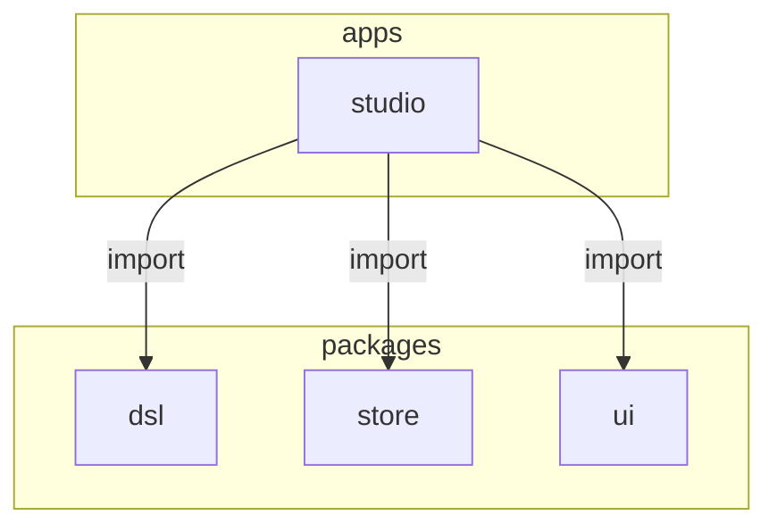
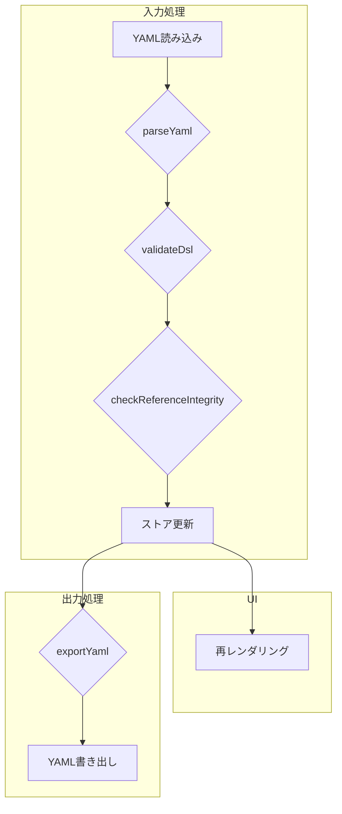
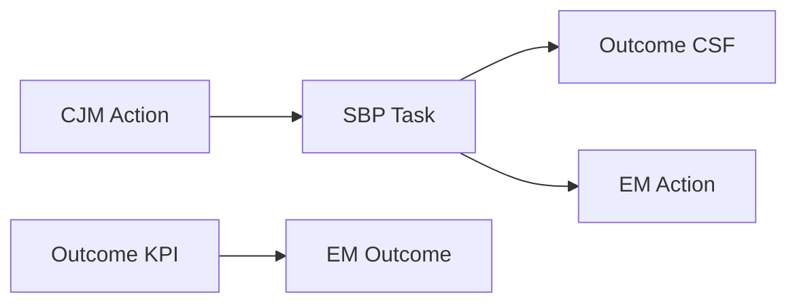

以下に、指定されたルールに従って整理したドキュメントを示します。

-----

# Enablement Map Studio 開発ガイドライン

## 1\. はじめに

### 1.1. プロジェクト概要

Enablement Map Studioは、顧客体験から事業成果創出までの一連のプロセスを設計するためのWebアプリケーションです。
本アプリケーションは、YAML形式で定義された4つのDSL（ドメイン固有言語）を視覚的に編集する機能を提供し、イネーブルメントサイクルの「整理ステージ」を支援します。

## 2\. アーキテクチャ

### 2.1. 全体構成

本プロジェクトは、pnpm workspaceを利用したモノレポ構成を採用しています。アプリケーション本体と、DSL定義や状態管理などの共通機能をパッケージとして分離しています。



| 要素名 | 説明 |
| :--- | :--- |
| `apps/studio` | メインとなるViteとReactで構築されたアプリケーション |
| `packages/dsl` | DSLの型定義、パーサー、バリデーター、参照チェッカー |
| `packages/store` | Zustandを利用した状態管理と、localStorageによるデータ永続化 |
| `packages/ui` | 複数のエディタで共有されるUIコンポーネント |

### 2.2. 技術スタック

| 分類 | 技術 |
| :--- | :--- |
| フロントエンド | React 18+, TypeScript, Vite |
| 状態管理 | Zustand |
| ルーティング | React Router v6 |
| UIライブラリ | Material-UI (MUI) v7 |
| DSL処理 | js-yaml, ajv |
| CJMエディタ | MUI Table, Recharts, @dnd-kit |
| SBPエディタ | @xyflow/react |
| コード品質 | qlty (biome, prettier, eslint) |
| パッケージ管理 | pnpm workspaces |

### 2.3. データフロー

Zustandストアを単一の信頼できる情報源 (Single Source of Truth) とし、すべてのエディタがこのストアを共有します。データはlocalStorageに永続化されます。

#### YAML処理パイプライン

YAMLファイルの読み込みと書き出しは、以下のパイプラインで処理します。



| 要素名 | 説明 |
| :--- | :--- |
| `parseYaml` | js-yamlを利用し、複数ドキュメント形式のYAMLファイルを解析 |
| `validateDsl` | ajvを利用し、JSONスキーマに基づきDSLデータを検証 |
| `checkReferenceIntegrity` | DSL間の参照整合性を検査 |
| `ストア更新` | 検証済みのデータをZustandストアに格納し、UIの再レンダリングをトリガー |
| `exportYaml` | 全てのDSLデータを単一のYAMLファイルに結合 |

### 2.4. データモデル (DSL)

本アプリケーションでは、`kind`フィールドで識別される4種類のDSLを扱います。

#### 2.4.1. DSL間の参照関係

各DSLは、`source_id`などのフィールドを用いて相互に参照し合います。



| 要素名 | 説明 |
| :--- | :--- |
| `CJM Action` | カスタマージャーニーマップ上の顧客のアクション |
| `SBP Task` | サービスブループリント上のタスク。CJM Actionを`source_id`で参照 |
| `Outcome CSF` | 重要成功要因。SBP Taskを`source_id`で参照 |
| `Outcome KPI` | 重要業績評価指標 |
| `EM Outcome` | イネーブルメントマップの成果。Outcome KPIを`source_id`で参照 |
| `EM Action` | イネーブルメントアクション。SBP Taskを`source_id`で参照 |

#### 2.4.2. CJM (Customer Journey Map) DSL

顧客体験を定義します。

| 要素 | 説明 |
| :--- | :--- |
| `kind` | `'cjm'` |
| `persona` | ペルソナ情報 (名前、説明) |
| `phases` | 旅のフェーズの配列 |
| `actions` | 顧客のアクションの配列。各アクションはフェーズに紐づき、感情スコア (-2から2) を持つ |

#### 2.4.3. SBP (Service Blueprint) DSL

顧客体験を支えるサービス提供側のプロセスを定義します。

| 要素 | 説明 |
| :--- | :--- |
| `kind` | `'sbp'` |
| `lanes` | スイムレーンの配列 |
| `tasks` | タスクの配列。CJMの`Action`を`source_id`で参照可能。`link_to`でタスク間を接続 |

#### 2.4.4. Outcome DSL

事業成果を定義します。

| 要素 | 説明 |
| :--- | :--- |
| `kind` | `'outcome'` |
| `kgi` | 重要目標達成指標 |
| `primary_csf` | 重要成功要因。SBPの`Task`を`source_id`で参照 |
| `primary_kpi` | 重要業績評価指標 |

#### 2.4.5. EM (Enablement Map) DSL

事業成果を達成するためのイネーブルメント要素を定義します。

| 要素 | 説明 |
| :--- | :--- |
| `kind` | `'em'` |
| `outcomes` | 成果の配列。Outcomeの`KPI`を`source_id`で参照 |
| `actions` | アクションの配列。SBPの`Task`を`source_id`で参照 |
| `skills` | `action_id`でアクションに紐づくスキル |
| `knowledge` | `action_id`でアクションに紐づくナレッジ |
| `tools` | `action_id`でアクションに紐づくツール |

### 2.5. 状態管理

アプリケーションの状態はZustandで管理します。

#### 2.5.1. Zustandストア

  - `cjm`, `sbp`, `outcome`, `em` の4つのDSLオブジェクトを状態として保持します。
  - `loadYaml()`や`exportYaml()`などのメソッドを提供します。
  - DSLの更新時には、自動で参照整合性チェックを実行します。
  - 状態はlocalStorageの`enablement-map-studio-storage`キーに永続化します。

#### 2.5.2. Undo/Redo機能

`use-undo`ライブラリを利用して、Undo/Redo機能を実現しています。DSLに対する全ての更新操作は自動的に履歴に記録されます。

### 2.6. File System Access API

Git連携をサポートするため、File System Access APIを使用したファイル操作機能を提供します。

#### 2.6.1. データモデル

```typescript
interface FileMetadata {
  fileName: string;
  lastSaved: Date;
  hasUnsavedChanges: boolean;
}
```

- `fileMetadata`: Zustandストアで管理し、localStorageに永続化
- `fileHandle`: React stateで管理（localStorageには保存不可）

#### 2.6.2. ファイル操作

| 操作 | API | 動作 |
| :--- | :--- | :--- |
| Open File | `showOpenFilePicker()` | ファイル選択ダイアログを表示し、選択されたファイルを読み込み |
| Save | `fileHandle.createWritable()` | 開いているファイルに上書き保存 |
| Save As... | `showSaveFilePicker()` | 名前を付けて保存ダイアログを表示し、新しいファイルに保存 |

#### 2.6.3. キーボードショートカット

- **Ctrl+S / Cmd+S**: Save（上書き保存）
- 未保存の変更がある状態でブラウザを閉じようとすると、警告ダイアログを表示

#### 2.6.4. ブラウザサポート

| ブラウザ | サポート |
| :--- | :--- |
| Chrome 86+ | ✅ |
| Edge 86+ | ✅ |
| Safari 15.2+ | ✅ |
| Firefox | ❌ (File System Access API 非対応) |

## 3\. 開発環境

### 3.1. 必須コマンド

| コマンド | 説明 |
| :--- | :--- |
| `pnpm dev` | 開発サーバーを起動 (http://localhost:5173) |
| `pnpm build` | 全てのパッケージをビルド |
| `pnpm type-check` | TypeScriptの型チェックを実行 |
| `pnpm lint` | コード品質チェックを実行 |
| `pnpm format` | コードをフォーマット |
| `pnpm test` | Vitestによるテストを実行 |

### 3.2. 推奨ツール

| ツール | 用途 |
| :--- | :--- |
| `Context` | 不明なツールやライブラリの利用方法の確認 |
| `chrome-devtools` | 画面のデバッグと確認 |
| `mcp-codex-cli`, `mcp-gemini-cli` | 問題解決のための相談 |
| `serena` | ソースコードへのアクセス |

### 3.3. TypeScript設定

  - 全てのパッケージは、プロジェクト参照のため`"composite": true`を使用します。
  - パッケージ間で型情報を共有するため、ルートの`tsconfig.json`にパスマッピングを設定しています。

### 3.4. ID生成ルール

全てのDSL要素のIDは、`generateId()`関数で生成します。IDは以下の形式です。

  - **形式**: `{kind}:{type}:{uuid}`
  - **例**: `cjm:action:123e4567-e89b-12d3-a456-426614174000`

## 4\. UI仕様

### 4.1. 共通仕様

#### 4.1.1. 通知システム

ユーザーへの通知は、共有UIパッケージで提供される以下の3つのコンポーネントを使用します。

| コンポーネント | 説明 |
| :--- | :--- |
| `ToastContext` | `useToast()`フックで、情報・成功・エラー通知を画面下部に表示 |
| `ConfirmDialogContext` | `useConfirm()`フックで、確認ダイアログを表示し、ユーザーの選択をPromiseで返す |
| `ErrorDialogContext` | `useErrorDialog()`フックで、エラーメッセージと詳細情報を表示するダイアログを制御 |

#### 4.1.2. デザインシステム

##### カラーパレット

| 用途 | カラーコード | 説明 |
| :--- | :--- | :--- |
| プライマリ | `#2e7d32` | ボタン、リンク、チャートなど、主要なUI要素に使用 |
| セカンダリ | `#66bb6a` | 補助的なUI要素やホバー状態に使用 |
| テキスト | `#424242` | 標準のテキストカラー |

##### ブランドアセット

| アセット | 用途 | 配置場所 |
| :--- | :--- | :--- |
| `logo.png` | ヘッダーロゴ | ヘッダー左側 |
| `icon.png` | ファビコン | ブラウザのタブ |

#### 4.1.3. CSF (重要成功要因) の表示

CSFに該当するタスクには「CSF」と表示されたチップを追加します。これにより、タスクが重要成功要因であることを示します。選択状態と明確に区別するため、枠線や背景色の変更による強調は行いません。

#### 4.1.4. CJMアクションの表示順序

全てのエディタ（CJM, Outcome, EM）で、CJMアクションの表示順序を統一します。アクションは、CJM DSLの`phases`配列の順序に基づいてソートします。

#### 4.1.5. ファイル操作

ヘッダーには、以下のボタンが配置されています。

| ボタン | アイコン | 動作 | 状態制御 |
| :--- | :--- | :--- | :--- |
| Open File | FolderOpen | ファイル選択ダイアログを表示し、YAMLファイルを読み込み | 常に有効 |
| Save | Save | 開いているファイルに上書き保存（ファイルハンドルがない場合はSave Asを実行） | ファイルハンドルがない、またはデータがない場合は無効 |
| Save As... | SaveAs | 名前を付けて保存ダイアログを表示し、新しいファイルに保存 | データがない場合は無効 |
| Load Sample | CloudDownload | サンプルデータを読み込み | 常に有効 |
| Clear Canvas | Delete | 全データをクリア（確認ダイアログ表示） | データがない場合は無効 |

**ファイル名の表示**:
- ファイルを開くと、ヘッダーにファイル名が表示されます
- 未保存の変更がある場合は、ファイル名の後に `*` マークが表示されます

**Saveボタンの状態表示**:
- 未保存の変更がある場合: `variant="contained"` で強調表示
- 未保存の変更がない場合: `variant="outlined"` で通常表示

#### 4.1.6. プロパティパネルの共通スタイル

全てのエディタ（CJM、SBP、Outcome、EM）のプロパティパネルは、以下の統一されたスタイルを採用しています。

| 要素 | スタイル | 説明 |
| :--- | :--- | :--- |
| Drawer variant | `temporary` | プロパティパネル表示時に暗いバックドロップ（オーバーレイ）を表示 |
| Width | `33vw` (最小 400px) | ビューポート幅の33%、最小幅は400px |
| Header | `display: 'flex', justifyContent: 'space-between', alignItems: 'center', mb: 3` | 「プロパティ」タイトルと閉じるボタンを水平配置 |
| Header Text | 「プロパティ」 | 全エディタで統一されたタイトル |
| Content Box | `flex: 1, overflow: 'auto'` | スクロール可能なコンテンツエリア |
| Stack Padding | `pt: 1` (CJM/SBP) | TextFieldラベルがヘッダーと重ならないよう上部にパディング |
| Actions (Buttons) | 画面下部に配置 | SAVEとDELETEボタンを固定配置 |
| DELETE Button | `variant="outlined", color="error"` | 白背景に赤枠のアウトラインスタイル |

### 4.2. CJMエディタ

#### 4.2.1. UI構成

  - MUIのテーブルをベースにしたレイアウトです。
  - テーブル上部にペルソナ情報をカード形式で表示します。
  - Rechartsを利用して、アクションごとの感情スコアを折れ線グラフで可視化します。

#### 4.2.2. 主要機能

  - ペルソナカードをクリックすると、プロパティパネルでペルソナ情報を編集できます。
  - フェーズとアクションは、ドラッグ＆ドロップで並び替えが可能です。
  - データが存在しない状態からでも、フェーズやアクションを直接追加できます。

#### 4.2.3. プロパティパネル

  - 画面右側に表示されるパネルで、選択した要素（ペルソナ、フェーズ、アクション）の詳細を編集します。
  - アクションのタッチポイントや思考・感情フィールドでは、改行を含む複数行のテキスト入力が可能です。
  - 要素を削除する際は、確認ダイアログを表示します。

### 4.3. SBPエディタ

#### 4.3.1. UI構成

  - `@xyflow/react`を利用したフローダイアグラムで、サービスブループリントを可視化します。
  - スイムレーン構造でタスクをグループ化します。
  - ミニマップ、コントロールパネル、背景グリッドを備えています。

#### 4.3.2. 主要機能

##### 状態管理

  - 状態はIDベースで管理し、Zustandストアの更新が常にUIに反映されるようにします。
  - useEffectを適切に分割し、DSLの変更を検知してReact Flowのノードやエッジを効率的に更新します。

##### CJM連動

  - CJM DSLが存在する場合、CJMの各アクションを読み取り専用のタスクとして自動的に表示します。
  - 読み取り専用タスクの位置情報は、ドラッグして変更するとlocalStorageに保存されます。

##### レーンとタスクの管理

  - レーンやタスクの追加、編集、削除が可能です。
  - レーンの削除は、プロパティパネルのボタン、またはDelete/Backspaceキーで行えます。
  - レーンの位置とサイズは、ドラッグやリサイズによって変更でき、その状態は永続化されます。
  - タスク間の接続は、ノードの四方向にあるハンドルをドラッグ＆ドロップして行います。

##### UX改善

  - タスクをドラッグする際、他のタスクと中央が揃う位置にスナップするアライメントガイドを表示します。
  - レーンをリサイズする際、他の要素の端にスナップするアライメントガイドを表示します。

#### 4.3.3. プロパティパネル

  - 画面右側に表示され、選択したレーンやタスクの名前、種別などを編集します。
  - 要素を削除する際は、確認ダイアログを表示します。

### 4.4. Outcomeエディタ

#### 4.4.1. UI構成

  - カードベースのレイアウトで、「CJM」「SBP」「組織の求める成果」の各要素を順に表示します。
  - 「組織の求める成果」カード内には、KGI、CSF、KPIを個別のカードとして表示します。

#### 4.4.2. 主要機能

  - CJMのフェーズを選択すると、関連するCJMアクションとSBPタスクのみを表示するフィルタリング機能があります。
  - SBPタスクをクリックすることで、そのタスクをCSFとして手動で設定します。
  - KPIの目標値は、日本のロケールに合わせたカンマ区切りで表示します。

#### 4.4.3. プロパティパネル

  - 画面右側に表示され、KGI、CSF、KPIの各要素の詳細を編集します。
  - KPIの目標値と単位をそれぞれ入力できます。

### 4.5. EMエディタ

#### 4.5.1. UI構成

  - **エディタペイン（上部）**: カードベースのレイアウトで、成果、顧客、プロセス、必要な行動を縦に表示します。
      - 「必要な行動」は、関連するSBPタスクごとにグループ化し、2カラムのフレックスレイアウトで表示します。
  - **リソース一覧ペイン（下部）**: リサイズ可能なテーブルで、スキル、ナレッジ、ツールなどのリソースを一覧表示します。

#### 4.5.2. 主要機能

  - CSF、CJMフェーズ、SBPレーンによるフィルタリング機能を備えています。CSFフィルタが最優先されます。
  - SBPタスクを選択し、「必要な行動を追加」ボタンをクリックすると、新しいEMアクションを作成できます。

#### 4.5.3. リソース一覧テーブル

  - 各行は「SBPタスク × EM行動 × リソース」の組み合わせを表します。
  - CSFに関連する行は、背景色を変えて強調表示します。
  - 全てのカラムで、ソート（昇順/降順）とテキスト検索が可能です。

#### 4.5.4. プロパティパネル

  - 画面右側に表示され、選択したEMアクションに紐づくスキル、ナレッジ、ツールを編集します。
  - 各スキルには、複数の学習コンテンツ（タイトルとURL）を登録できます。
  - 全ての削除操作（行動、スキル、ナレッジ、ツールなど）で確認ダイアログを表示します。

## 5\. 開発ルールとベストプラクティス

### 5.1. 開発ワークフロー

DSLのスキーマを変更する場合は、以下の手順に従います。

1.  `packages/dsl/src/types/`内のTypeScript型定義を更新します。
2.  `packages/dsl/src/schemas/`内のJSONスキーマを更新します。
3.  必要に応じて、参照チェックのロジック (`reference-check.ts`) を更新します。
4.  サンプルファイル (`apps/studio/public/sample.yaml`) を更新します。
5.  `pnpm build` を実行して、変更を検証します。

### 5.2. 実装ガイドライン

  - レンダリング中に状態を更新しないでください。状態更新は`useEffect`内やイベントハンドラ内で行います。
  - `useEffect`の依存配列は、意図しない再実行を防ぐために適切に管理します。
  - ローカルで定義したコンポーネントとインポートしたコンポーネントの名前が競合しないように注意します。

### 5.3. コード共通化の指針

  - 同じロジックが3箇所以上で使用される場合は、共通のユーティリティ関数への集約を検討します。
  - 共通化する関数は、副作用のない純粋関数として実装します。
  - ユーティリティ関数は、機能ごとに`utils/`ディレクトリに配置します。

### 5.4. バージョン管理

#### .gitignore設定

ビルド成果物（`dist/`, `*.tsbuildinfo`）や環境変数ファイル（`.env`）は、リポジトリに含めません。これらは`.gitignore`ファイルで除外します。

#### Git Rebaseでのコンフリクト解決

ビルド成果物でコンフリクトが発生した場合は、再ビルドで生成可能であるため、常に最新のバージョン（HEAD側）を採用して解決します。

## テスト

### ユニットテスト

- フレームワーク: Vitest
- アプローチ: t-wadaさん推奨のTDDアプローチ
- テスト構造: Given / When / Then
- 命名規則: テスト対象メソッド名_XXXの場合_YYYであること
- 実行コマンド:
  - `pnpm test` - ウォッチモードでテスト実行
  - `pnpm test:run` - 1回のみテスト実行

### e2eテスト

- フレームワーク: Playwright
- テストファイル配置: `apps/studio/e2e/`
- テスト種別:
  - **スモークテスト** (`smoke.spec.ts`)
    - アプリケーションの基本的な動作確認
    - サンプルYAMLのロード、各エディタページへの遷移
    - YAMLのエクスポート、データのクリア
  - **正常系シナリオ** (`happy-path.spec.ts`)
    - 空の状態から各エディタで要素を新規作成
    - CJM、SBP、Outcome、EMの全エディタでデータ作成を確認
    - YAMLのエクスポート/インポートでデータが保持されることを確認
    - localStorageへの永続化を確認
  - **更新・削除シナリオ** (`update-delete.spec.ts`)
    - サンプルデータをロードしてから各エディタで更新・削除操作を確認
    - **ドラッグ＆ドロップ操作を含む**:
      - CJMエディタ: フェーズとアクションの並び替え
      - SBPエディタ: タスクの移動、レーンのサイズ変更、レーンの移動、エッジの削除
    - CSF（重要成功要因）の付け替え
    - EMエディタ: スキル、ナレッジ、ツール、学習コンテンツの変更・削除
- 実行コマンド:
  - `pnpm test:e2e` - ヘッドレスモードでe2eテスト実行（全テスト）
  - `pnpm test:e2e:ui` - UIモードでe2eテスト実行（デバッグ用）
  - `pnpm test:e2e:headed` - ブラウザを表示してe2eテスト実行

#### e2eテスト実装のベストプラクティス

1. **MUI Selectコンポーネントの操作**:
   - アクセシビリティ属性（`labelId`, `id`）を設定して、テストで安定して要素を取得できるようにする
   - 操作フロー: combobox要素をクリック → listboxが表示される → listbox内でoptionを選択 → listboxが閉じる
   - strict mode violationを避けるため、listboxスコープ内でoptionを検索する
   - ヘルパー関数 `selectMuiOption(page, selectId, optionName)` を使用すると、この操作を簡潔に記述できる

2. **待機処理**:
   - `page.waitForTimeout()`の使用を避け、要素の状態変化を待つ`expect().toBeVisible()`や`.not.toBeVisible()`を使用する
   - タイムアウトはエラーを隠蔽するため、適切な待機条件を設定する
   - ただし、MUIのTextFieldで値の変更を認識させるための短い待機（100ms）は例外的に許容される

3. **DrawerとDialogの違い**:
   - OutcomeエディタとEMエディタは`variant="persistent"`のDrawerを使用
   - Drawerは`getByRole('dialog')`では見つからないため、内部の要素で確認する

4. **要素の特定**:
   - strict mode violationを避けるため、コンテナでスコープしてから要素を検索する
   - ヘルパー関数 `getAddButtonInSection(page, sectionText)` を使用すると、セクション内の追加ボタンを特定できる
   - 例: `getAddButtonInSection(page, 'スキル (0)')`

5. **ヘルパー関数の活用**:
   - `apps/studio/e2e/helpers.ts` に以下のヘルパー関数を定義：
     - `fillInput(page, locator, value)`: 入力フィールドに値を入力
     - `selectMuiOption(page, selectId, optionName)`: MUI Selectでオプションを選択
     - `getAddButtonInSection(page, sectionText)`: セクション内の追加ボタンを取得
   - 共通処理をヘルパー関数に抽出することで、テストコードの重複を削減し、保守性を向上させる
   - `happy-path.spec.ts` と `update-delete.spec.ts` でこれらのヘルパー関数を再利用

#### ドラッグ＆ドロップテストの実装

ドラッグ＆ドロップのe2eテストには、以下の技術的課題への対応が必要です：

**使用ライブラリ:**
- CJMエディタ: `@dnd-kit/core` (PointerSensor with `activationConstraint.distance: 8`)
- SBPエディタ: `@xyflow/react` (React Flow)

**実装のポイント:**
1. **ポインターイベントの使用**: `page.dragAndDrop()`ではなく、`page.mouse`を使用
   - `@dnd-kit`とReact FlowはHTML5 dragイベントではなくポインターイベントをリスン
2. **activation constraintへの対応**: @dnd-kitの設定（distance: 8）を考慮し、最初に10px移動してからドラッグ
3. **親要素のターゲティング**: DragIndicatorアイコンではなく、`{...listeners}`を持つ親Box要素をターゲット
4. **適切な待機時間**: `waitForTimeout(30ms)`でactivation delayを尊重

詳細は`apps/studio/e2e/utils/drag-helpers.ts`を参照してください。

## Docker構成

### ディレクトリ構成

Docker関連のファイルは`docker/`ディレクトリにまとめられています：

- `docker/nginx.conf` - HTTPS対応のnginx設定ファイル
- `docker/generate-cert.sh` - 自己署名証明書生成スクリプト

### HTTPS対応

Dockerイメージは以下のHTTPS機能を提供します：

| 項目 | 説明 |
|------|------|
| ポート80 (HTTP) | HTTPSへの自動リダイレクト (301) |
| ポート443 (HTTPS) | TLSv1.2/1.3対応のセキュア接続 |
| 証明書 | 100年間有効な自己署名証明書 (ビルド時に生成) |
| SAN対応 | localhost, *.localhost, 127.0.0.1, ::1, 0.0.0.0 |

### ビルドプロセス

Dockerfileは2段階ビルドを使用：

1. **ビルダーステージ** (node:18-alpine):
   - pnpmでの依存関係インストール
   - TypeScriptとViteでのビルド

2. **本番ステージ** (nginx:alpine):
   - OpenSSLのインストール
   - 証明書生成スクリプトの実行
   - nginx設定のコピー
   - ビルド済み静的ファイルのコピー

### 起動方法

```bash
# HTTPとHTTPSの両方を公開
docker run -p 8080:80 -p 8443:443 ghcr.io/suwa-sh/enablement-map-studio:latest

# HTTPSでアクセス
# https://localhost:8443
```

**注意**: 自己署名証明書を使用しているため、ブラウザで証明書警告が表示されます。「詳細設定」→「localhost にアクセスする（安全ではありません）」で進むことができます。

## 作業ルール

- 作業を開始する前に、`README.md`と`REQUIREMENTS.md`、`ARCHITECTURE.md`、`DEVELOPMENT.md`を読み込み、仕様とルールを理解してください。
- 実装が完了したら、すべての静的解析、テストが通ることを確認してください
  - `pnpm check`
  - `pnpm build`
- Chrome DevToolsで画面表示と動作を確認してください。
- 今回修正した範囲とそれに関連する既存コードのリファクタリングを行ってください。
- 回帰テストで他への影響がないことを確認してください。
  - `pnpm test:e2e`
- 作業完了後、`CLAUDE.md`, `README.md`, `REQUIREMENTS.md`、`ARCHITECTURE.md`、`DEVELOPMENT.md`を最新の状態に更新してください。
