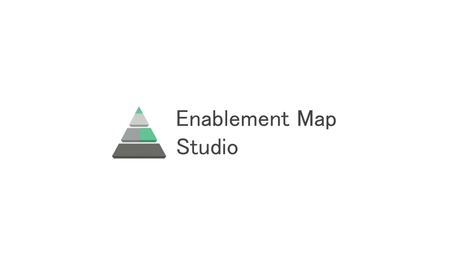

# Enablement Map Studio



[イネーブルメントで人材育成を成果につなげる](https://note.com/suwash/n/n02fa7e60d409)で紹介しているイネーブルメントのサイクルの内、整理ステージを支援するビジュアルエディタです。

## クイックスタート

### Dockerで利用

```bash
# イメージを取得（最新バージョン）
docker pull ghcr.io/suwa-sh/enablement-map-studio:latest

# コンテナを起動
docker run -p 8080:80 ghcr.io/suwa-sh/enablement-map-studio:latest
```

アプリケーションは http://localhost:8080 でアクセスできます。

### 開発環境で利用

開発環境のセットアップ方法については、[DEVELOPMENT.md](./DEVELOPMENT.md) を参照してください。

## 概要

単一のYAMLファイル（\`---\`区切りで複数のDSLを含む）を読み込み、以下の4つのエディタビューをシームレスに切り替えながら、一気通貫で計画を立案・編集できます：

- **CJM Editor**: カスタマージャーニーマップの可視化
- **SBP Editor**: サービスブループリント（業務プロセスの可視化）
- **Outcome Editor**: ビジネス成果の定義（CSF/KPI）
- **EM Editor**: イネーブルメントマップ（行動、スキル、ナレッジ、ツール）

## 主な機能

### CJM Editor
- **ペルソナ表示・編集**: テーブル上部にペルソナカードを表示、クリックでPropertyPanelを開いて編集（ペルソナ名・説明を複数行テキストで入力可能）
- フェーズとアクションのドラッグ&ドロップによる並び替え
- 感情スコア (-2 ~ +2) による感情曲線の可視化
- タッチポイント・思考感情の複数行入力対応
- 空状態からの直接作成（ボタン常時表示）

### SBP Editor
- React Flowベースのフローダイアグラム
- CJM連動（CJMアクションを自動的にreadonly タスクとして表示）
- レーン種別（CJM, Human, Team, System）対応
- **レーン削除**: 3つの方法で削除可能
  - DELETEボタン（PropertyPanel、確認ダイアログ付き）
  - Deleteキー（レーン選択時）
  - Backspaceキー（レーン選択時）
  - すべての方法でレーンと関連タスク・接続を一括削除、localStorageに永続化
- レーンリサイズ + アライメントガイド（他レーン・タスクの端に吸着）
- レーン位置・サイズの永続化
- タスク追加ダイアログ（レーン選択 + 名前入力）
- 4方向接続ハンドル + タスクアライメントガイド（中央位置で吸着）
- ドラッグ&ドロップによるタスク接続とCJM \`source_id\` 自動設定

### Outcome Editor
- **フィルタリング機能**: CJMフェーズフィルタリング（関連SBPタスクのみ表示）
  - フィルターアコーディオン（デフォルト閉じた状態、スティッキー表示）
  - **フィルター有効時にバッジ表示**（SBPタスク件数を表示）
  - **エッジ接続を考慮**: 選択フェーズに直接リンクされたタスク + それらのタスクに接続されているタスクも表示
  - CJMアクションはフェーズ順にソート（CJMエディタと表示順を統一）
- SBP領域に説明テキスト「タスクの中から、CSFを選択してください。」を表示
- SBPタスククリックによるCSF設定（手動選択、自動設定なし）
- **CSF表示**: CSFタスクにはバッジ（Chip）のみで強調、選択状態と明確に区別
- **KGI/CSF/KPI個別カード表示**: 薄い緑背景、CSFカードにはソースタスク名（太字）+ 説明を表示
- 数値フォーマット（カンマ区切り、小数点自動調整）
- PropertyPanel（33vw幅、MUI Drawer、KGI/CSF/KPI間隔を1.5倍に拡大）
- 初期表示: SBP未定義時は「SBPを作成するか YAML をロードしてください」

### EM Editor
- カードベースレイアウト（求める成果/顧客/CJMフェーズ/SBPレーン・タスク/EM行動）
- **フィルタリング機能**（CSF/CJMフェーズ/SBPレーン）
  - フィルターアコーディオン（デフォルト閉じた状態、スティッキー表示）
  - **フィルター有効時にバッジ表示**（EM行動件数を表示）
  - CJMアクションはフェーズ順にソート（CJMエディタと表示順を統一）
- **組織の価値提供プロセス領域**: 説明テキスト「タスクを選択して、「必要な行動を追加」ボタンをクリックしてください。」を表示
- **CSF表示**: CSFタスクにはバッジ（Chip）のみで強調、選択状態と明確に区別
- **必要な行動のグルーピング表示**: SBPタスクごとにEM行動をグループ化
  - タスク名をグループ見出しとして表示（行動件数バッジは廃止）
  - 行動カード内にはタスク名を表示しない（冗長性を排除）
- **リソース一覧テーブル**: Paper elevation={2}でカードラップ、ソート・検索・CSF強調表示、CSVダウンロード機能
- PropertyPanel（スキル/ナレッジ/ツール編集、学習コンテンツ対応）
- 「必要な行動を追加」ボタンで新規EM Action作成
- クリック外で閉じる機能
- 初期表示: Outcome未定義時は「Outcomeを作成するか YAML をロードしてください」

### 共通機能
- localStorageによる永続化
- YAML形式でのインポート/エクスポート
- サンプルデータのロード
- Clear Canvasボタン（データクリア）
- **MUI通知システム**: Toast（情報・成功・エラー通知）、ConfirmDialog（削除確認など）、ErrorDialog（エラー詳細表示）
- **Undo/Redo機能**: すべての編集操作を履歴管理、ボタンで元に戻す・やり直すが可能
  - タスク名変更、タスク・レーンのドラッグ移動、レーンのリサイズ、削除操作などに対応
  - 各操作で1回のUndoで元の状態に戻る

## デザインシステム

### カラーパレット
- **プライマリカラー**: \`#2e7d32\` (Material Design Green 800) - 緑系のメインカラー
- **セカンダリカラー**: \`#66bb6a\` (Material Design Green 400) - 明るい緑
- **テキストカラー**: \`#424242\` (Material Design Grey 800) - 濃いグレー
  - 純粋な黒（#000000）より目に優しく、視認性を保ちながら柔らかい印象

### ブランドアセット
- **ロゴ**: \`/logo.png\` - ヘッダー左側に表示（40px高さ）
- **アイコン**: \`/icon.png\` - favicon、ブラウザタブに表示

## 技術スタック

- **言語**: TypeScript
- **フレームワーク**: React 18+
- **ビルドツール**: Vite
- **状態管理**: Zustand (with persist middleware)
- **ルーティング**: React Router v6
- **スタイリング**: Material-UI (MUI) v7
- **エディタUI**:
  - CJM: MUIテーブル + Recharts + @dnd-kit (ドラッグ&ドロップ)
  - SBP: @xyflow/react (フローダイアグラム)
  - Outcome: MUI Paper/Stack/Button + フィルタリング機能
  - EM: MUI Paper/Stack/Button + react-resizable-panels + TableSortLabel
- **DSL処理**: js-yaml, ajv
- **Linter/Formatter**: qlty (biome, prettier, eslint)
- **パッケージ管理**: pnpm workspaces

## Dockerイメージについて

### 利用可能なタグ

- \`latest\` - 最新リリースバージョン
- \`{version}\` - 特定のバージョン（例: \`1.0.0\`, \`1.0\`, \`1\`）
- \`sha-{commit}\` - 特定のコミット

### カスタムポート

```bash
# 別のポートで起動
docker run -p 3000:80 ghcr.io/suwa-sh/enablement-map-studio:latest

# 特定のバージョンを指定
docker run -p 3000:80 ghcr.io/suwa-sh/enablement-map-studio:1.0.0
```

### データの永続化

このアプリケーションは**ブラウザのlocalStorage**にデータを保存します。Dockerコンテナを再起動してもブラウザ側のデータは保持されます。

## 開発に参加する

開発環境のセットアップ、ビルド方法、コーディング規約については、[DEVELOPMENT.md](./DEVELOPMENT.md) を参照してください。

## ライセンス

MIT License

## 関連ドキュメント

- [DEVELOPMENT.md](./DEVELOPMENT.md) - 開発環境セットアップと開発ガイド
- [REQUIREMENTS.md](./REQUIREMENTS.md) - 詳細仕様
- [CLAUDE.md](./CLAUDE.md) - Claude Code用の実装ガイド
- [イネーブルメントのコンセプト](https://note.com/suwash/n/n02fa7e60d409)
