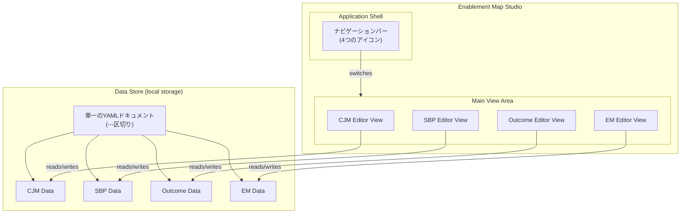
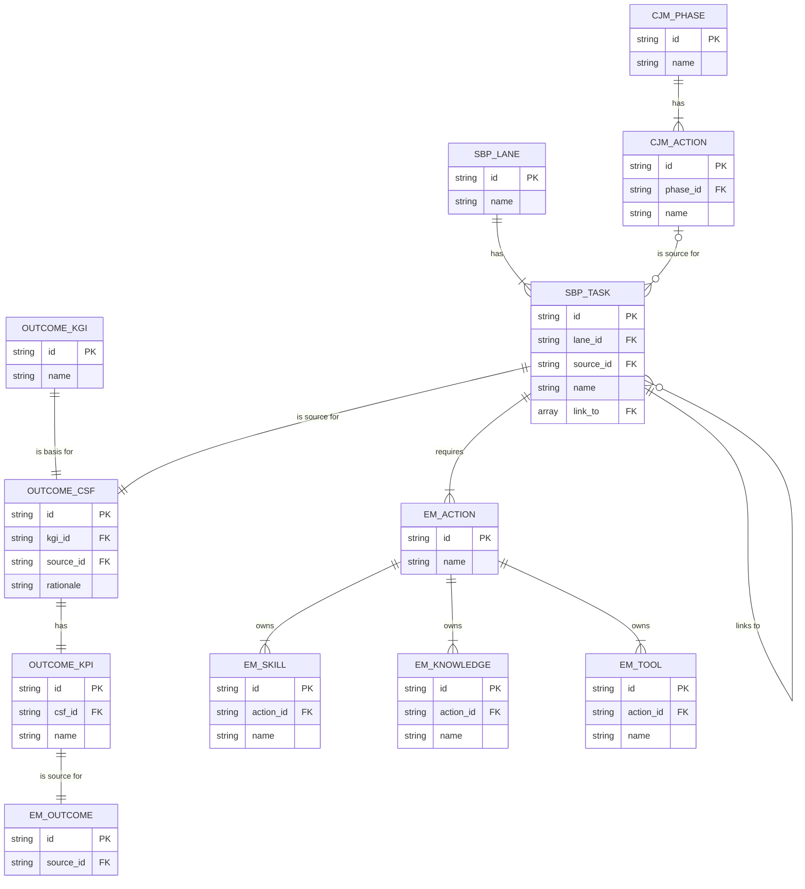

## Enablement Map Studio 仕様・設計

### 1\. 概要

#### 1.1. 目的

本仕様書は「**Enablement Map Studio**」について定義します。これは、顧客体験の可視化から成果創出までのプロセスを一貫して設計するための、**単一の統合Webアプリケーション**です。単一のYAMLファイル（`---`区切りで複数のDSLを内包）を読み込み、CJM、SBP、Outcome、EMという4つの専用ビュー（エディタ）をシームレスに切り替えながら、一気通貫で計画を立案・編集します。

#### 1.2. アプリケーションの全体像

アプリケーションは、左端のナビゲーションバーで4つのエディタビューを切り替えるシングルページアプリケーションとして構成されます。全てのビューは、local storage上の一つのデータソース（読み込まれたYAMLファイル）を共有します。



-----

### 2\. 全体コンセプト

#### 2.1. 目的

顧客体験の可視化（CJM）、業務プロセスの整理（SBP）、成果の定義（Outcome）、そして成果達成に向けた行動・スキル設計（EM）までを一貫して計画できる、オープンソースのエディタ群を提供します。

#### 2.2. 各エディタの役割

| エディタ名 | 役割 | 主な出力 | 依存関係 |
| :--- | :--- | :--- | :--- |
| **CJM Editor** | 顧客行動の可視化（外部視点） | Customer Journey Map | なし |
| **SBP Editor** | 顧客行動を支える業務プロセスの可視化 | Service Blueprint | CJMを参照 |
| **Outcome Editor**| ビジネス成果（CSF/KPI）の決定 | Outcome Definition | SBPを参照 |
| **EM Editor** | 成果に紐づくイネーブルメント構造の設計 | Enablement Map | Outcome, SBP, CJMを参照 |

-----

### 3\. データモデル (DSL仕様)

各エディタのデータは、人間が読み書きしやすいYAML形式のDSL（Domain-Specific Language）で定義します。ここでは各DSLのサンプルと、その構造を検証するためのJSON Schemaを併記します。

#### 3.1. 共通仕様

  - **フォーマット**: YAML形式を採用します。`---`区切りにより、1つのファイルに複数のDSLを記述できます。
  - **種別明示**: ルート要素に`kind`キーを設け、DSLの種別（`cjm`, `sbp`, `outcome`, `em`）を明示します。
  - **グローバルID**: `id`キーは、エディタ間で情報を参照するためのグローバルな一意識別子として機能します。

#### 3.2. データモデルの全体像 (ER図)

本仕様書で定義する全てのデータエンティティと、その関係性、命名規則は以下のER図に集約されます。



##### 3.2.1. 外部キー命名規則

データモデルの一貫性を担保するため、外部キー（FK）の命名には以下のルールを適用します。

  - **同一DSL内のID参照**: キー名は `{参照先オブジェクト名}_id` とします。（例: `EM_SKILL` から `EM_ACTION` への参照は `action_id`）
  - **別DSLへのID参照**: キー名は `source_id` とします。（例: `SBP_TASK` から `CJM_ACTION` への参照は `source_id`）

#### 3.3. CJM DSL (Customer Journey Map)

顧客（この場合は事業部門のシステム利用者）の体験を、システム開発のフェーズごとに定義します。

##### 3.3.1. YAMLサンプル (v1.0)

```yaml
kind: cjm
version: 1.0
id: cjm:sysdev-lifecycle
persona:
  name: 事業部門のシステム利用ユーザー
phases:
  - { id: cjm:phase:requirement, name: 要件定義 }
  - { id: cjm:phase:uat, name: UAT (受け入れテスト) }
actions:
  - id: cjm:action:communicate-requirements
    name: "システムの要件を開発チームに伝える"
    phase: cjm:phase:requirement
    touchpoints:
      - "定例会議"
      - "ドキュメント共有システム (Confluenceなど)"
    thoughts_feelings:
      - "正しく意図が伝わるか不安だ"
      - "専門用語が多くて理解が難しい"
    emotion_score: -1
  - id: cjm:action:execute-uat
    name: "開発されたシステムをテストする"
    phase: cjm:phase:uat
    touchpoints:
      - "テスト環境"
      - "操作マニュアル"
      - "QAチーム"
    thoughts_feelings:
      - "思った通りに動くか心配"
      - "不具合を見つけなければ、というプレッシャーがある"
    emotion_score: 0
```

##### 3.3.2. JSON Schema定義

CJM DSLを検証するためのJSON Schemaは以下のファイルで定義されています。

[packages/dsl/src/schemas/cjm.json](packages/dsl/src/schemas/cjm.json)

#### 3.4. SBP DSL (Service Blueprint)

CJMで定義されたユーザーの行動を支える、開発チームの業務タスクを定義します。

##### 3.4.1. YAMLサンプル (v1.0)

```yaml
kind: sbp
version: 1.0
id: sbp:sysdev-support
lanes:
  - { id: lane:cjm, name: System User, kind: cjm }
  - { id: lane:dev-team, name: Development Team, kind: team }
tasks:
  - id: cjm:action:execute-uat
    lane: lane:cjm
    name: "開発されたシステムをテストする"
    readonly: true
    position: { x: 100, y: 50 }
  - id: sbp:task:support-uat
    lane: lane:dev-team
    name: "UAT環境を準備し、ユーザーを支援する"
    source_id: "cjm:action:execute-uat"
    position: { x: 100, y: 50 }
connections:
  - source: cjm:action:execute-uat
    target: sbp:task:support-uat
    sourceHandle: bottom
    targetHandle: top
```

##### 3.4.2. JSON Schema定義

SBP DSLを検証するためのJSON Schemaは以下のファイルで定義されています。

[packages/dsl/src/schemas/sbp.json](packages/dsl/src/schemas/sbp.json)

#### 3.5. Outcome DSL (成果定義)

SBPで可視化された開発チームの業務タスクの中から、ビジネス成果に最も影響を与えるCSFとKPIを1つずつ定義します。

##### 3.5.1. YAMLサンプル (v1.0)

```yaml
kind: outcome
version: 1.0
id: oc:sysdev-quality
kgi:
  id: oc:kgi
  name: 開発サイクルの迅速化と品質向上
primary_csf:
  id: oc:csf
  kgi_id: "oc:kgi"
  source_id: "sbp:task:support-uat"
  rationale: "UATの手戻りを削減することが、リリース速度向上に直結する"
primary_kpi:
  id: oc:kpi
  csf_id: "oc:csf"
  name: UAT初回合格率
  definition: "初回UATで合格した件数 / UAT実施件数"
  unit: "%"
  target: 90
```

##### 3.5.2. JSON Schema定義

Outcome DSLを検証するためのJSON Schemaは以下のファイルで定義されています。

[packages/dsl/src/schemas/outcome.json](packages/dsl/src/schemas/outcome.json)

#### 3.6. EM DSL (Enablement Map)

定義した成果（UAT初回合格率の向上）を起点とし、それを達成するために開発チームが行うべき具体的行動と、それに必要なスキル・ナレッジを定義します。

##### 3.6.1. YAMLサンプル (v1.0)

```yaml
kind: em
version: 1.0
id: em:sysdev-enablement
outcomes:
  - id: em:outcome:uat-pass-rate
    source_id: "oc:kpi"
actions:
  - id: em:act:testcase-design
    name: UATシナリオに基づきテストケースを設計する
    source_id: "sbp:task:support-uat"
  - id: em:act:prepare-test-data
    name: UAT用のテストデータを準備する
    source_id: "sbp:task:support-uat"
skills:
  - id: em:skill:test-design
    name: テスト設計スキル
    action_id: "em:act:testcase-design"
    learnings:
      - { title: "テスト設計技法トレーニング", url: "https://lms.local/courses/test-design" }
  - id: em:skill:sql-scripting
    name: テストデータ抽出のためのSQLスクリプト作成スキル
    action_id: "em:act:prepare-test-data"
    learnings:
      - { title: "実践SQLクエリトレーニング", url: "https://lms.local/courses/sql-training" }
knowledge:
  - id: em:knowledge:testcase-template
    name: テストケース設計テンプレート
    action_id: "em:act:testcase-design"
    url: "https://sharepoint.local/templates/test-case"
  - id: em:knowledge:db-schema-document
    name: テスト対象DBのスキーマ定義書
    action_id: "em:act:prepare-test-data"
    url: "https://confluence.local/db-schema"
tools: []
```

##### 3.6.2. JSON Schema定義

EM DSLを検証するためのJSON Schemaは以下のファイルで定義されています。

[packages/dsl/src/schemas/em.json](packages/dsl/src/schemas/em.json)

-----

### 4\. UI設計

#### 4.1. アプリケーションシェル (共通コンテナ)

Enablement Map Studioは、すべてのエディタビューを内包する共通のシェルUIを提供します。

| UI要素 | 内容 | 補足 |
| :--- | :--- | :--- |
| **ナビゲーションバー** | 画面左端に縦に配置 | CJM, SBP, Outcome, EMの各エディタに切り替えるための4つのアイコンを配置。 |
| **メインビューエリア** | 中央の広範な領域 | ナビゲーションバーで選択されたエディタ（CJM Editorなど）が描画される。 |
| **プロパティパネル** | 右ペイン | メインビューエリアで選択された要素の詳細を編集するパネル。全てのビューで共通のコンポーネント。 |

- 参考
  - 

#### 4.2. 各エディタビューのUI詳細

##### CJM Editor

  - **実装状況**: ✅ 完成
  - **技術スタック**: MUI Table + Recharts + @dnd-kit
  - **中央キャンバス**:
    - **ペルソナカード**: テーブル上部にMUI Paperで表示、クリックでPropertyPanel表示
      - 表示内容: "ペルソナ: {name}" のみ（説明は非表示）
      - cursor: pointer、ホバー時に背景色変化
      - クリックでPropertyPanelが開き、ペルソナ編集が可能
    - MUIテーブルベースのレイアウト
    - 表外にツールバー（フェーズ追加、アクション追加ボタン）
    - フェーズヘッダー行（ドラッグハンドル付き、水平並び替え可能）
    - アクション行（各フェーズ内でドラッグ&ドロップで並び替え可能）
    - タッチポイント行、思考・感情行
    - 感情曲線（Recharts LineChart、高さ240px）
  - **操作**:
    - フェーズ追加: 自動的に「アクション 1」を作成
    - アクション追加: ダイアログでフェーズ選択+名前入力
    - ドラッグ&ドロップ: フェーズとアクションの順番を入れ替え
    - クリック: プロパティパネル表示（activationConstraint: 8px）
  - **プロパティパネル**:
    - 幅: 33vw（最小400px）
    - **ペルソナ編集**:
      - タイトル: "ペルソナ"
      - ペルソナ名: TextField（1行）
      - 説明: TextField multiline（rows=6、複数行テキスト）
      - SAVE のみ（DELETEボタンなし、ペルソナは削除不可）
    - **アクション編集**: アクション → タッチポイント → 思考・感情 → 感情スコア
    - **フェーズ編集**: フェーズ名
    - すべて日本語ラベル
    - アクション・フェーズ・ペルソナは排他的に表示
  - 参考
    - 


##### SBP Editor

  - **実装状況**: ✅ 完成
  - **技術スタック**: @xyflow/react (React Flow)
  - **中央キャンバス**:
    - スイムレーン構造（種別: `cjm`, `human`, `team`, `system`）
    - CJMレーン (`kind: 'cjm'`): CJMアクションから自動生成されたreadonlyタスク
    - 他のレーン: ユーザーが追加・編集可能なタスク
    - タスク間を矢印（エッジ）で接続（ドラッグ&ドロップ）
    - ミニマップ、コントロールパネル、背景グリッド
  - **除外機能**:
    - TIME行、EVIDENCE行は不要（仕様から削除）
  - **操作**:
    - レーン追加: 左上の「レーン追加」ボタンから即座に追加
    - レーン削除: DELETEキー、またはプロパティパネルのDELETEボタン
    - レーン並び替え: レーンノードをドラッグして上下移動
    - レーンリサイズ: レーン選択時に表示されるNodeResizerハンドルでサイズ変更
      - 最小幅800px、最小高さ150px、最大高さ400px
      - リサイズ中に他レーン・タスクの端（右端・下端）との距離が10px以内で破線ガイド表示＋自動スナップ
      - リサイズ終了時にスナップ位置を確定
      - レーン位置・サイズは`position: {x, y}`と`size: {width, height}`をDSLに保存
    - タスク追加: 左上の「タスク追加」ボタン（レーン選択+名前入力）
    - タスク接続: ドラッグ&ドロップで矢印を作成（`connections[]`配列に追加）
      - 4方向ハンドル対応: `top`, `right`, `bottom`, `left` いずれからでも接続可能
      - D&D仕様: D&D開始側が`source`、終了側が`target`（矢印は終了側に表示）
      - ハンドル位置保持: 実際にD&Dした接続ポイントを`sourceHandle`、`targetHandle`に記録
      - CJM連動: CJM readonlyタスクから通常タスクへの接続時、自動的にタスクの`source_id`を設定
      - 削除時の連動: CJM接続エッジ削除時、タスクの`source_id`を自動的にクリア
    - タスク削除: DELETEキー、またはプロパティパネルのDELETEボタン
    - タスクアライメントガイド: タスクD&D時に他タスクとの中央位置で破線ガイド表示＋自動スナップ（閾値5px）
    - 位置情報永続化: 通常タスク・CJM readonlyタスクともに`position: {x, y}`をDSLに保存
  - **CJM連動**:
    - `kind: 'cjm'`レーンに`readonly: true`タスクを自動表示
    - ノードID: `cjm-readonly-{actionId}` 形式
    - CJM更新時にSBPのreadonlyタスクを自動的に追加・削除・更新
    - readonly表示（グレーアウト、編集不可、ミニマップで灰色）
    - CJM readonlyタスクから通常タスクへの接続時、自動的に`source_id`を設定
    - CJM readonlyノードもアライメントガイドとスナップの対象
  - **プロパティパネル**:
    - 幅: 33vw（最小400px）
    - タスク編集: タスク名、レーン選択、削除
    - レーン編集: レーン名、種別（CJMレーンは変更不可）
    - SAVE/DELETE時の即時反映（ID-based状態管理）
  - **技術的詳細**:
    - ID-based状態管理: `selectedLaneId`でstale closure回避
    - 選択的useEffect更新: レーン・タスク・CJM readonlyを独立して同期
    - `flowConverter.ts`: DSL ⇔ React Flow形式の相互変換
      - `convertDslToFlow()`: DSLからReact Flow形式に変換、`connections[]`を`edges`に変換、レーン位置・サイズ読み込み
      - `updateDslFromFlow()`: React Flow形式からDSLに変換、`edges`を`connections[]`に変換、レーン位置・サイズ保存
      - CJM readonly nodeのID変換: 内部ID `cjm-readonly-{actionId}` ⇔ DSL ID `{actionId}`
      - 位置情報保存: 通常タスク・CJM readonlyタスクともに`position`を保存
      - レーンサイズ抽出: NodeResizerのサイズは`node.measured?.width/height`, `node.width/height`, `node.style?.width/height`の優先順で取得
    - レーン配置: Y座標 = `index * (LANE_HEIGHT + LANE_SPACING)`, デフォルトサイズ: `LANE_WIDTH=1400`, `LANE_HEIGHT=300`
    - タスクアライメントガイド: `useAlignmentGuides` フックによる破線ガイド表示とスナップ処理（閾値5px）
    - レーンリサイズアライメントガイド: `handleLaneResize`, `handleLaneResizeEnd`による破線ガイド表示とスナップ処理（閾値10px）
    - エッジマーカー: `markerEnd` を使用して矢印を終了側（target）に表示
    - 接続削除処理: `handleEdgesDelete` でCJM接続エッジ削除時に`source_id`をクリア
  - 参考
    - 

##### Outcome Editor

  - **実装状況**: ✅ 完成（カード型レイアウト）
  - **技術スタック**: MUI Paper/Stack/Button + PropertyPanel (Drawer)
  - **中央エリア**:
    - **求める成果カード**: KGI/CSF/KPI個別カード表示（「求める成果」カード内にネスト）
    - **CJMフェーズフィルタ**: ボタンで選択したフェーズに対応するSBPタスクをフィルタ表示
    - **SBPタスク表示**: レーンごとにカード形式でタスクを表示
    - **CSF設定**: SBPタスクカードをクリックして`primary_csf.source_id`を設定
  - **PropertyPanel** (右ペイン):
    - 幅: 33vw（最小400px）
    - KGI名入力
    - CSF: ソースタスク表示（readonly）+ 説明入力
    - KPI: 名前、説明、目標値、ユニット選択
    - 数値フォーマット対応（カンマ区切り、小数点自動調整）

##### EM Editor

  - **実装状況**: ✅ 完成（カードベースレイアウト）
  - **技術スタック**: MUI Paper/Stack/Button + react-resizable-panels + TableSortLabel
  - **エディタペイン** (上部):
    - **求める成果カード**: KGI/CSF/KPI表示（KPI: `{名前}: {目標値}{ユニット}` 形式）
    - **CSFフィルタボタン**: CSFに紐づくCJMアクション、SBPレーン・タスク、EM行動のみ表示
    - **CJMフェーズフィルタ**: フェーズ選択で関連要素をフィルタ
    - **SBPレーンフィルタ**: レーン選択で関連タスク・行動をフィルタ
    - **SBPタスクカード**: レーンごとにタスクを表示
    - **EM行動カード**: タスクごとに行動を表示（クリックでPropertyPanel表示）
  - **リソース一覧ペイン** (下部):
    - リサイズ可能なテーブル（react-resizable-panels）
    - カラム: CSF（チェックボックス）/CJMフェーズ/CJMアクション/SBPレーン/SBPタスク/必要な行動/リンクタイプ/名前/URL
    - CSF行の強調表示（緑色背景 `#c8e6c9`、太字）
    - 全カラムでソート可能（TableSortLabel）
    - テキスト検索フィルタ
    - 互い違いの背景色（白/薄いグレー）
  - **PropertyPanel** (右ペイン):
    - 幅: 33vw（最小400px）
    - 行動名入力
    - スキル一覧（学習コンテンツ `title` フィールド使用）
    - ナレッジ一覧（名前＋URL）
    - ツール一覧（名前＋URL）
    - 各リソースの追加・削除機能
    - SAVE/DELETEボタン
  - **操作**:
    - 「必要な行動を追加」ボタン: 新規EM Action作成
    - CSF/フェーズ/レーンフィルタ: ボタンクリックでフィルタリング
    - 行動カードクリック: PropertyPanel表示（`stopPropagation()`で保護）
    - PropertyPanel以外をクリック: パネルを閉じる
  - **データ構造**:
    - 階層: Outcome KPI → CJM Phase → CJM Action → SBP Task → EM Actions → Skills/Knowledge/Tools
    - 学習コンテンツ: `{ title, url }` （`id`、`name`フィールドなし）
    - インデックスベースの更新で連動問題を解消

-----

### 5\. 操作フローの例

1.  **ファイルを開く**: アプリケーションの開始画面で「YAMLファイルを開く」ボタンをクリックし、`---`で区切られたDSL群を含む単一の `.yaml` ファイルを読み込みます。
2.  **CJMを編集**: 左のナビゲーションバーで「CJM」アイコンをクリックします。メインビューにCJM Editorが表示され、YAML内の `kind: cjm` の部分を編集できます。
3.  **SBPを編集**: 「SBP」アイコンをクリックします。ビューがSBP Editorに切り替わります。CJMで編集した内容は即座にSBPの表示に反映されます。
4.  **成果を定義**: 「Outcome」アイコンをクリックし、Outcome EditorでCSFとKPIを定義します。
5.  **施策を設計**: 「EM」アイコンをクリックし、EM Editorで具体的な施策を設計します。
6.  **エクスポート**: 編集が完了したら、「エクスポート」ボタンを押し、全ての変更内容を含んだ単一のYAMLファイルとして保存します。

-----

### 6\. 実装方針

単一ファイル・マルチビューのWebアプリケーションとしてOSS化するため、以下の実装方針を採用します。

| 項目 | 内容 |
| :--- | :--- |
| **プロジェクト構成** | **モノレポ構成** (pnpm workspaces) |
| **技術基盤** | React / TypeScript |
| **アプリケーションシェル**| React (Vite)。ナビゲーションとビューの切り替えはReact Router v6で管理。 |
| **状態管理** | **単一のグローバルストア** (Zustand with persist middleware) で、読み込んだYAMLのパース結果（4つのDSLオブジェクト）を一元管理。各エディタビューはこのストアからデータを読み書きする。 |
| **エディタモジュール** | @xyflow/react (React Flow) および Material-UI (MUI)。各エディタはシェルから動的にロードされるコンポーネントとして開発。 |
| **DSL管理** | YAMLパーサー (js-yaml), JSON Schemaバリデーター (ajv) を共通パッケージとして管理。 |
| **共通UIキット** | エディタ間で共通のボタン、パネル、アイコンなどをまとめたUIコンポーネントライブラリを開発。 |
| **OSSライセンス** | MIT License |

-----

### 7\. 設計上の重要な仕様

#### 7.1. データ参照方式

##### CJMアクションの参照（SBP内）
- SBP内のCJMレーンタスクは、CJMエディタで定義されたアクションへの**参照**として扱います
- CJMエディタで変更すると、SBPビューにも自動的に反映されます
- `readonly: true`はSBPエディタ上で編集不可を意味します

##### DSL間の関連性
- 1つのSBP Taskに対して、複数のEM Actionが紐づきます（1対多）
- 1つのEM Actionは、必ず1つのSBP Taskにのみ紐づきます
- EM ActionからSBP Taskへの参照は`source_id`フィールドを使用します

#### 7.2. UI操作仕様

##### SBP Editorでのタスク間矢印の描画
- ユーザーがUI上で手動で矢印を描画します
- タスクをドラッグ&ドロップで接続すると、起点タスクの`link_to`配列に終点タスクのIDが追加されます
- 1つのタスクから複数のタスクへ矢印を引くことができます（`link_to`は配列）

##### Outcome EditorでのCSF設定
- SBPタスクカードをクリックすることで、そのタスクを`primary_csf.source_id`として設定します
- CSFが設定されると、PropertyPanelが自動的に開き、CSFの説明やKPI情報を入力できます
- フェーズフィルタボタンで特定のCJMフェーズに関連するSBPタスクのみを表示できます

##### EM Editorの階層表示
- UIでは `Outcome → CJMフェーズ → CJMアクション → SBPタスク → EMアクション群 → skills, knowledge, tools` の階層で表示します
- この階層は、EM OutcomeのKPI → CSF → SBP Task → CJM Action → CJM Phase という参照を逆引きして自動生成します

#### 7.3. ID生成と管理

##### 自動生成ルール
- ユーザーが新しい要素（Phase, Action, Task, etc.）を作成すると、アプリケーションが自動的にIDを生成します
- フォーマット: `{dsl種別}:{エンティティタイプ}:{UUID}`
- 例: `cjm:action:550e8400-e29b-41d4-a716-446655440000`
- ユーザーはIDを直接編集する必要はありません（内部的に管理）

#### 7.4. バージョン管理

##### 初期実装
- 初期実装ではバージョンチェックは行いません
- `version`フィールドは将来の拡張のために予約されています
- すべてのDSLは`version: 1.0`で統一します

-----

### 8\. 実装状況

#### 8.1. 完了済み機能

##### CJM Editor
- ✅ **ペルソナ表示・編集**: テーブル上部にペルソナカードを表示、クリックでPropertyPanel表示（ペルソナ名・説明を複数行テキストで編集可能）
- ✅ MUIテーブルベースのUI
- ✅ フェーズとアクションのドラッグ&ドロップ並び替え（@dnd-kit）
- ✅ 感情曲線の可視化（Recharts、-2〜+2スコア）
- ✅ タッチポイント・思考感情フィールドの改行対応
- ✅ PropertyPanel（33vw幅、MUI Drawer）
- ✅ 空状態からの直接作成（フェーズ追加・アクション追加ボタン常時表示）
- ✅ 削除確認ダイアログ統合（アクション削除、フェーズ削除）

##### SBP Editor
- ✅ React Flowベースのフローダイアグラム
- ✅ スイムレーン構造（レーン追加・削除・種別変更）
- ✅ CJM連動（CJMアクション自動同期、CJM存在時の自動初期化）
- ✅ タスク追加ダイアログ（レーン選択＋名前入力）
- ✅ 4方向接続ハンドル＋アライメントガイド
- ✅ D&Dによるタスク接続とCJM `source_id`自動設定
- ✅ PropertyPanel（タスク・レーン編集）
- ✅ ID-based状態管理による即時反映
- ✅ 削除確認ダイアログ統合（タスク削除、レーン削除）

##### Outcome Editor
- ✅ MUI Paper/Stack/Buttonによるカード型レイアウト
- ✅ CJMフェーズフィルタリング機能（関連SBPタスクのみ表示）
- ✅ SBPタスククリックによるCSF設定
- ✅ KGI/CSF/KPI個別カード表示（「求める成果」カード内にネスト）
- ✅ 数値フォーマット（カンマ区切り、小数点自動調整）
- ✅ PropertyPanel（KGI/CSF/KPI編集）
- ✅ 自動初期化（useEffect）

##### EM Editor
- ✅ カードベースレイアウト（MUI Paper/Stack/Button）
- ✅ エディタペイン: 求める成果/CJMフェーズ/SBPレーン・タスク/EM行動の表示
- ✅ フィルタリング機能: CSF/CJMフェーズ/SBPレーン
- ✅ **リソース一覧テーブル**: Paper elevation={2}でカードラップ（padding 24px、grey.50背景色）、ソート・検索・CSF強調表示（チェックボックス、緑色背景）
- ✅ PropertyPanel: スキル/ナレッジ/ツール編集（学習コンテンツ `title` フィールド対応）
- ✅ 「必要な行動を追加」ボタンで新規EM Action作成
- ✅ クリック外で閉じる機能（PropertyPanel）
- ✅ 自動初期化（useEffect）
- ✅ 削除確認ダイアログ統合（行動削除、スキル削除、学習コンテンツ削除、ナレッジ削除、ツール削除の5箇所）

##### 共通機能
- ✅ localStorageによる永続化（Zustand persist middleware）
- ✅ YAML形式でのインポート/エクスポート
- ✅ サンプルデータのロード
- ✅ Clear Canvasボタン（データクリア）
- ✅ 参照整合性チェック（バリデーション）
- ✅ **MUI通知システム**: Toast（Snackbar + MUI Alert）、ConfirmDialog、ErrorDialog
  - すべての `window.confirm` を `useConfirm()` に置き換え
  - uiパッケージに配置、全エディタから共通利用

#### 8.2. 今後の改善予定

##### 共通
- ⏳ Undo/Redo機能
- ⏳ すべてのエディタのUX改善（使いやすさ・見やすさの向上）
