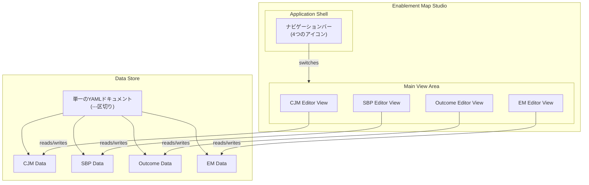
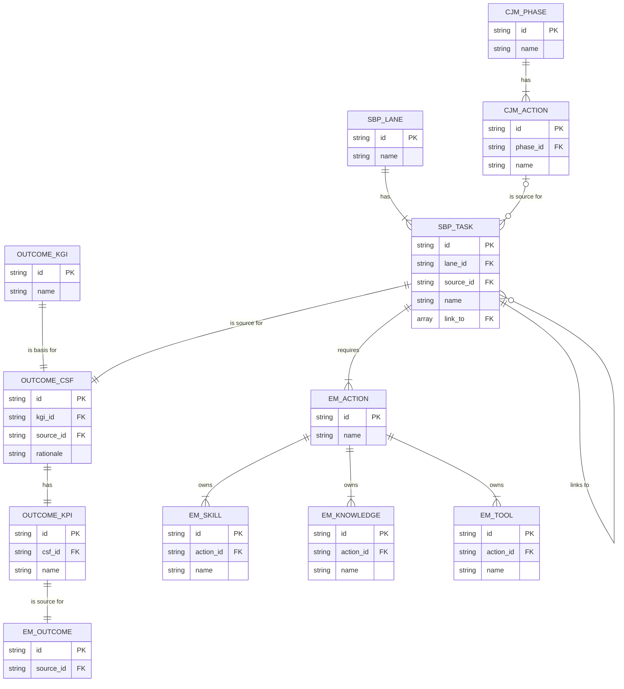

## Enablement Map Studio ルール仕様書

### 1\. 概要

#### 1.1. 目的

「Enablement Map Studio」は、顧客体験の可視化から成果創出までのプロセスを一貫して設計するための、**単一の統合Webアプリケーション**です。単一のYAMLファイルをデータソースとし、CJM、SBP、Outcome、EMという4つの専用ビュー（エディタ）をシームレスに切り替えながら、計画を立案・編集します。

#### 1.2. アプリケーションの全体像

本アプリケーションは、左端のナビゲーションバーで4つのエディタビューを切り替えるシングルページアプリケーションとして構成されます。全てのビューは、単一のデータソースを共有します。



### 2\. 全体コンセプト

#### 2.1. 目的

顧客体験の可視化（CJM）、業務プロセスの整理（SBP）、成果の定義（Outcome）、そして成果達成に向けた行動・スキル設計（EM）までを一貫して計画できる、エディタ群を提供します。

#### 2.2. 各エディタの役割

| エディタ名 | 役割 | 主な出力 | 依存関係 |
| :--- | :--- | :--- | :--- |
| **CJM Editor** | 顧客行動の可視化（外部視点） | Customer Journey Map | なし |
| **SBP Editor** | 顧客行動を支える業務プロセスの可視化 | Service Blueprint | CJMを参照 |
| **Outcome Editor**| ビジネス成果（CSF/KPI）の決定 | Outcome Definition | SBPを参照 |
| **EM Editor** | 成果に紐づくイネーブルメント構造の設計 | Enablement Map | Outcome, SBP, CJMを参照 |

### 3\. データモデル (DSL仕様)

各エディタのデータは、YAML形式のDSL（Domain-Specific Language）で定義します。

#### 3.1. 共通仕様

  - **フォーマット**: YAML形式。`---`区切りにより、1つのファイルに複数のDSLを記述できます。
  - **種別明示**: ルート要素に`kind`キーを設け、DSLの種別（`cjm`, `sbp`, `outcome`, `em`）を明示します。
  - **バージョン**: 全てのDSLの`version`は`1.0`とします。
  - **グローバルID**: `id`キーは、エディタ間で情報を参照するためのグローバルな一意識別子として機能します。

#### 3.2. データモデルの全体像 (ER図)



##### 3.2.1. 外部キー命名規則

  - **同一DSL内のID参照**: キー名は `{参照先オブジェクト名}_id` とします。（例: `EM_SKILL` の `action_id`）
  - **別DSLへのID参照**: キー名は `source_id` とします。（例: `SBP_TASK` の `source_id`）

#### 3.3. CJM DSL (Customer Journey Map)

顧客の体験をフェーズごとに定義します。

```yaml
kind: cjm
version: 1.0
id: cjm:sysdev-lifecycle
persona:
  name: 事業部門のシステム利用ユーザー
phases:
  - { id: cjm:phase:requirement, name: 要件定義 }
  - { id: cjm:phase:uat, name: UAT (受け入れテスト) }
actions:
  - id: cjm:action:communicate-requirements
    name: "システムの要件を開発チームに伝える"
    phase: cjm:phase:requirement
    touchpoints: ["定例会議", "ドキュメント共有システム (Confluenceなど)"]
    thoughts_feelings: ["正しく意図が伝わるか不安だ", "専門用語が多くて理解が難しい"]
    emotion_score: -1
  # ... more actions
```

#### 3.4. SBP DSL (Service Blueprint)

CJMで定義されたユーザー行動を支える業務タスクを定義します。

```yaml
kind: sbp
version: 1.0
id: sbp:sysdev-support
lanes:
  - { id: lane:cjm, name: System User, kind: cjm }
  - { id: lane:dev-team, name: Development Team, kind: team }
tasks:
  - id: cjm:action:execute-uat # CJM Actionへの参照
    lane: lane:cjm
    name: "開発されたシステムをテストする"
    readonly: true
    position: { x: 100, y: 50 }
  - id: sbp:task:support-uat
    lane: lane:dev-team
    name: "UAT環境を準備し、ユーザーを支援する"
    source_id: "cjm:action:execute-uat" # CJM Actionとの関連付け
    position: { x: 100, y: 50 }
connections:
  - source: cjm:action:execute-uat
    target: sbp:task:support-uat
    sourceHandle: bottom
    targetHandle: top
```

#### 3.5. Outcome DSL (成果定義)

SBPのタスクから、ビジネス成果に影響を与えるCSFとKPIを定義します。

```yaml
kind: outcome
version: 1.0
id: oc:sysdev-quality
kgi:
  id: oc:kgi
  name: 開発サイクルの迅速化と品質向上
primary_csf:
  id: oc:csf
  kgi_id: "oc:kgi"
  source_id: "sbp:task:support-uat" # SBP Taskとの関連付け
  rationale: "UATの手戻りを削減することが、リリース速度向上に直結する"
primary_kpi:
  id: oc:kpi
  csf_id: "oc:csf"
  name: UAT初回合格率
  definition: "初回UATで合格した件数 / UAT実施件数"
  unit: "%"
  target: 90
```

#### 3.6. EM DSL (Enablement Map)

定義した成果を達成するための具体的行動と、それに必要なスキル・ナレッジを定義します。

```yaml
kind: em
version: 1.0
id: em:sysdev-enablement
outcomes:
  - id: em:outcome:uat-pass-rate
    source_id: "oc:kpi" # Outcome KPIとの関連付け
actions:
  - id: em:act:testcase-design
    name: UATシナリオに基づきテストケースを設計する
    source_id: "sbp:task:support-uat" # SBP Taskとの関連付け
skills:
  - id: em:skill:test-design
    name: テスト設計スキル
    action_id: "em:act:testcase-design"
    learnings:
      - { title: "テスト設計技法トレーニング", url: "https://lms.local/courses/test-design" }
knowledge:
  - id: em:knowledge:testcase-template
    name: テストケース設計テンプレート
    action_id: "em:act:testcase-design"
    url: "https://sharepoint.local/templates/test-case"
tools: []
```

### 4\. UIルール

#### 4.1. アプリケーションシェル (共通コンテナ)

| UI要素 | 内容 |
| :--- | :--- |
| **ナビゲーションバー** | 画面左端に縦に配置。CJM, SBP, Outcome, EMの各エディタに切り替える4つのアイコンを配置。 |
| **メインビューエリア** | 中央の広範な領域。選択されたエディタが描画される。 |
| **プロパティパネル** | 右ペイン。メインビューで選択された要素の詳細を編集するパネル。全ビューで共通。 |

#### 4.2. 各エディタビューのUIルール

##### CJM Editor

  - **レイアウト**: テーブルベースのレイアウト。上部にペルソナカード、テーブルのヘッダーにフェーズ、行にアクション、タッチポイント、思考・感情を配置。最下部に感情曲線のグラフを表示。
  - **ペルソナカード**: 「ペルソナ: {name}」と表示。クリックするとプロパティパネルでペルソナ名と説明を編集可能。ペルソナは削除不可。
  - **操作**:
      - フェーズとアクションはドラッグ＆ドロップで並び替え可能。
      - 各要素（ペルソナ、フェーズ、アクション）をクリックするとプロパティパネルで詳細を編集できる。

##### SBP Editor

  - **レイアウト**: スイムレーン構造のキャンバス。レーン内にタスクを配置し、タスク間を矢印（エッジ）で接続する。
  - **レーン種別**: `cjm`, `human`, `team`, `system`の4種。
  - **CJM連動**:
      - `kind: 'cjm'`のレーンには、CJMで定義されたアクションが編集不可(`readonly: true`)のタスクとして自動的に表示される。
      - CJMの内容が更新されると、このレーンのタスクも自動的に追加・削除・更新される。
  - **操作**:
      - レーンとタスクの追加・削除・編集が可能。
      - レーンはドラッグで上下に並び替え、ハンドルでサイズ変更が可能。
      - タスクはドラッグで移動可能。移動時には他のタスクと中央位置が揃うとガイド線が表示され、自動でスナップする。
      - タスクのハンドルをドラッグ＆ドロップすることで、タスク間に矢印を作成・接続できる。
      - CJMの`readonly`タスクから通常タスクへ接続すると、通常タスクの`source_id`が自動的に設定される。この接続を削除すると`source_id`もクリアされる。
  - **仕様**:
      - TIME行、EVIDENCE行は仕様に含まない。
      - タスクとレーンの位置・サイズ情報はDSLに保存される。

##### Outcome Editor

  - **レイアウト**: 「CJM」→「SBP」→「組織の求める成果」の順にカード形式で情報を表示。
  - **初期表示**: SBPが未定義の場合、「SBPを作成するか YAML をロードしてください」と表示。
  - **フィルタリング**:
      - CJMフェーズでSBPタスクをフィルタリングできる。
      - フィルターが有効な場合、フィルタリング後のSBPタスク件数をバッジで表示する。
  - **CSF設定**: SBP領域に表示されたタスクカードをクリックすることで、そのタスクをCSFのソース(`primary_csf.source_id`)として設定する。
  - **組織の求める成果カード**: KGI, CSF, KPIを個別のカードとして強調表示する。
  - **プロパティパネル**: KGI名、CSFの説明、KPIの名前・説明・目標値・ユニットを編集できる。

##### EM Editor

  - **レイアウト**: 上部の「エディタペイン」と下部の「リソース一覧ペイン」に分かれる。
  - **初期表示**: Outcomeが未定義の場合、「Outcomeを作成するか YAML をロードしてください」と表示。
  - **エディタペイン**: 「組織の求める成果」→「顧客」→「顧客の意思決定プロセス」→「組織の価値提供プロセス」→「必要な行動」の順にカード形式で表示。
  - **フィルタリング**:
      - CSF、CJMフェーズ、SBPレーンによって、表示される情報をフィルタリングできる。
      - フィルターが有効な場合、フィルタリング後のEM行動件数をバッジで表示する。
  - **必要な行動カード**: SBPタスクごとにEM行動をグループ化して表示する。行動カードをクリックするとプロパティパネルで編集可能。
  - **リソース一覧ペイン**:
      - 全てのスキル、ナレッジ、ツールを一覧表示するリサイズ可能なテーブル。
      - カラム: CSF, CJMフェーズ, CJMアクション, SBPレーン, SBPタスク, 必要な行動, リンクタイプ, 名前, URL。
      - 全てのカラムでソート、テキスト検索が可能。
      - CSVダウンロード機能を持つ。
  - **プロパティパネル**: 行動名、および関連するスキル、ナレッジ、ツールの一覧を編集できる。

### 5\. デザインシステム

#### 5.1. カラーパレット

| 用途 | カラーコード |
| :--- | :--- |
| **プライマリカラー** (ボタン, アクティブ状態など) | `#2e7d32` |
| **セカンダリカラー** (補助要素, ホバー状態など) | `#66bb6a` |
| **テキストカラー** (本文, 見出し) | `#424242` |
| **セカンダリテキスト** (補足テキスト, ラベル) | `#616161` |

#### 5.2. ブランドアセット

| アセット | 配置 | サイズ |
| :--- | :--- | :--- |
| **ロゴ** (`/logo.png`) | ヘッダー左側 | 高さ40px |
| **アイコン** (`/icon.png`) | favicon | - |

#### 5.3. UIコンポーネント規則

  - **フィルターバッジ (Outcome/EMエディタ)**:
      - フィルターが有効な場合にのみ表示される。
      - `size="small"`, `color="primary"` のChipコンポーネントを使用。
      - Outcomeエディタではフィルタリング後のSBPタスク件数、EMエディタではEM行動件数を表示する。

### 6\. データと操作のルール

#### 6.1. データ参照

  - **CJMアクションの参照**: SBP内のCJMレーンタスクは、CJMで定義されたアクションへの**参照**として扱う。CJMでの変更はSBPに自動的に反映される。
  - **DSL間の関連性**:
      - 1つのSBPタスクに対して、複数のEM行動が紐づく（1対多）。
      - 1つのEM行動は、必ず1つのSBPタスクにのみ紐づく。
      - EM行動からSBPタスクへの参照には`source_id`フィールドを使用する。

#### 6.2. UI操作

  - **SBPのタスク間接続**: UI上でタスク間をドラッグ＆ドロップで接続すると、起点タスクの`link_to`配列に終点タスクのIDが追加される。
  - **OutcomeのCSF設定**: SBPタスクカードをクリックすると、そのタスクが`primary_csf.source_id`として設定され、プロパティパネルが自動的に開く。
  - **EMの階層表示**: UI上の`Outcome → CJM → SBP → EM`の階層は、DSLの参照関係（`source_id`）を逆引きして自動的に生成される。

#### 6.3. ID生成と管理

  - **自動生成ルール**: ユーザーが新しい要素（Phase, Action, Taskなど）を作成すると、アプリケーションが自動的にIDを生成する。
  - **フォーマット**: `{dsl種別}:{エンティティタイプ}:{UUID}` （例: `cjm:action:550e8400-e29b-41d4-a716-446655440000`）

### 7\. 共通機能

#### 7.1. ファイル操作

| 機能 | 説明 | UI |
| :--- | :--- | :--- |
| Open File | ローカルのYAMLファイルを開く | ヘッダーの「Open File」ボタン |
| Save | 開いているファイルに上書き保存 | ヘッダーの「Save」ボタン、または Ctrl+S / Cmd+S |
| Save As... | 別名で保存 | ヘッダーの「Save As...」ボタン |
| Load Sample | サンプルデータを読み込み | ヘッダーの「Load Sample」ボタン |
| Clear Canvas | 全データをクリア（確認ダイアログ表示） | ヘッダーの「Clear Canvas」ボタン |

**ファイル名の表示**:
- ファイルを開くと、ヘッダーにファイル名が表示されます
- 未保存の変更がある場合は、ファイル名の後に `*` マークが表示されます

**保存前の確認**:
- 未保存の変更がある状態でブラウザを閉じようとすると、警告ダイアログが表示されます

#### 7.2. データ永続化

- localStorageによる自動保存
- ブラウザのリロード後もデータが保持されます

#### 7.3. Undo / Redo

- Ctrl+Z / Cmd+Z: Undo（元に戻す）
- Ctrl+Shift+Z / Cmd+Shift+Z: Redo（やり直し）
- ヘッダーの Undo / Redo ボタンでも操作可能

#### 7.4. キーボードショートカット

| ショートカット | 動作 |
| :--- | :--- |
| Ctrl+S / Cmd+S | Save（上書き保存） |
| Ctrl+Z / Cmd+Z | Undo（元に戻す） |
| Ctrl+Shift+Z / Cmd+Shift+Z | Redo（やり直し） |
